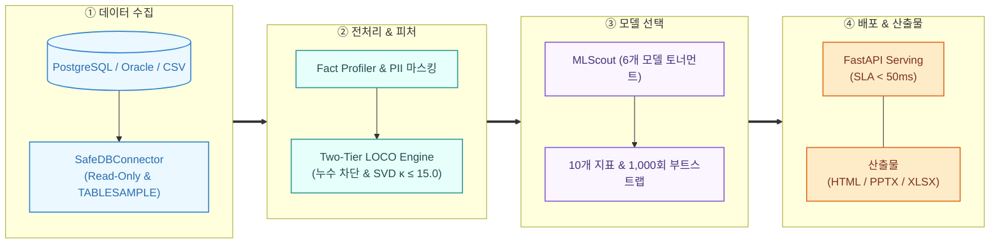
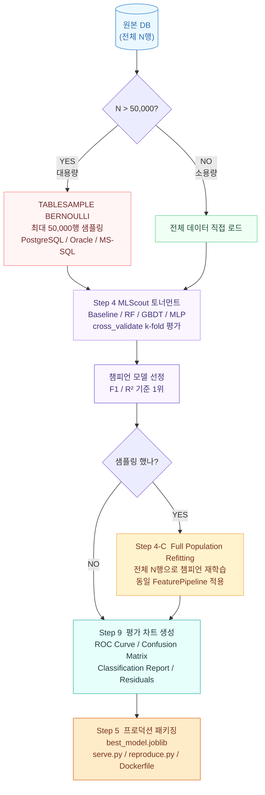

# Auto Data Analyzer & ML Scout

DB나 CSV 파일을 Read-Only로 연결하면, 피처 엔지니어링부터 모델 선택, 평가 리포트(PPTX/HTML/XLSX)까지 자동으로 처리해주는 ML 자동화 파이프라인입니다.

[](https://www.python.org/)
[](https://fastapi.tiangolo.com/)
[](tests/)

---

## 시스템 구조

<div align="center">
  
</div>

<details>
<summary><b>파이프라인 전체 흐름 보기</b></summary>


</details>

---

## 실행 방법

### 웹 UI
```bash
uv run streamlit run web.py
```
사이드바에서 CSV 파일을 선택하거나 DB URL을 입력하면 바로 분석이 시작됩니다.

### CLI
```bash
# CSV 파일 분석
uv run run.py --db-url "data/sample_customers.csv" --target "churn"

# SQLite
uv run run.py --db-url "sqlite:///tests/data/sample_warehouse.db" --table "customers" --target "churn"

# PostgreSQL (설정 파일)
uv run python src/main.py --config configs/db_config_postgres.yaml --table "aihub_career_counseling_mart" --target "job_label"

# 테스트 실행
uv run pytest -v

# 모델 재현성 검증
uv run python dist/export_pipeline/reproduce.py
```

---

## ML 학습 파이프라인 — 샘플 탐색 → 전체 재학습

데이터가 50,000행을 넘으면 먼저 샘플로 빠르게 최적 모델을 찾고, 이후 전체 데이터로 재학습해서 프로덕션 모델을 만듭니다.



| 단계 | 역할 | 대상 데이터 |
|------|------|------------|
| Step 4 Scout | 모델 탐색 | 샘플 ≤ 50,000행 |
| Step 4-C Refit | 전체 데이터 재학습 | 전체 N행 (샘플링 시에만) |
| Step 9 Eval | 평가 차트 생성 | 최종 학습 데이터 기준 |
| Step 5 Export | `best_model.joblib` 저장 | 전체 데이터 학습 모델 |

---

## AI-Hub 공공 데이터 실측 결과

국가 AI-Hub 데이터(총 125만 건)를 PostgreSQL에 적재하고 직접 실행한 결과입니다.

<div align="center">

| 데이터셋 | 규모 | 테이블 | 예측 대상 | 최적 모델 | 성능 | 대조군 대비 |
| :--- | :---: | :--- | :--- | :---: | :---: | :---: |
| 270번 진로상담·직업추천 | 22,106건 | `aihub_career_counseling_mart` | `job_label` | LightGBM | 0.9875 | +86.78% |
| 142번 학생 교육역량 | 335,436건 | `aihub_student_competency_mart` | `data_type` | LogisticRegression | 0.4894 | +0.20% |
| 149번 표 정보 QA | 900,000건 | `aihub_table_qa_mart` | `is_impossible` | ExtraTrees | 0.7066 | +1.46% |

</div>

- 125만 건 실운영 DB 연결 시 DDL/DML 쓰기 0건 (`Read-Only` + `TABLESAMPLE BERNOULLI`)
- 다중 분류, 이진 분류, 텍스트 피처 추출 등 스키마 무관하게 수동 튜닝 없이 모델링 완료
- 테이블별 `serve.py`, `best_model.joblib`, `reproduce.py`, PPTX, HTML, 엑셀 자동 생성

---

## 문서

- [01_개발_원칙_및_보안정책.md](docs/01_개발_원칙_및_보안정책.md)
- [02_PRD_시스템_기획서.md](docs/02_PRD_시스템_기획서.md)
- [03_시스템_아키텍처_설계서.md](docs/03_시스템_아키텍처_설계서.md)
- [04_장표_레이아웃_및_메트릭_명세.md](docs/04_장표_레이아웃_및_메트릭_명세.md)
- [05_피어리뷰_및_개선피드백.md](docs/05_피어리뷰_및_개선피드백.md)
- [06_프로젝트_작업이력_및_핸드오버.md](docs/06_프로젝트_작업이력_및_핸드오버.md)
- [07_유스케이스_및_시나리오_명세서.md](docs/07_유스케이스_및_시나리오_명세서.md)
- [08_인터페이스_정의서_및_시퀀스_다이어그램.md](docs/08_인터페이스_정의서_및_시퀀스_다이어그램.md)
- [09_깃허브_브랜치_전략_및_PR_정책.md](docs/09_깃허브_브랜치_전략_및_PR_정책.md)
