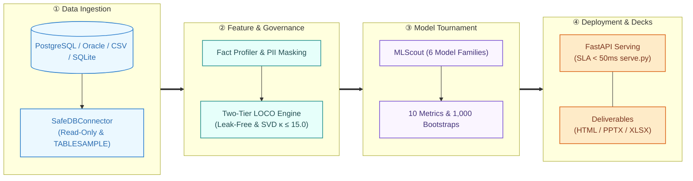
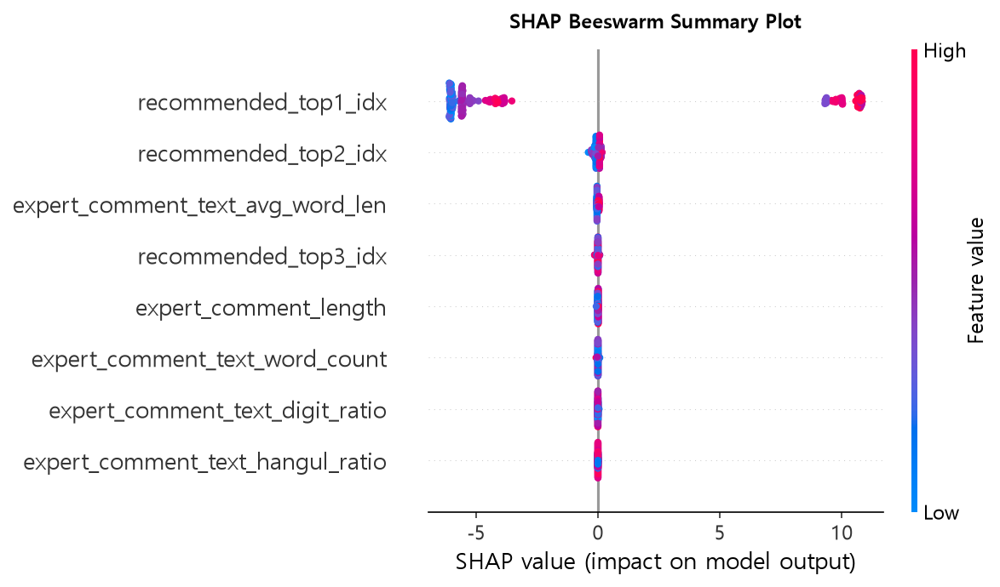
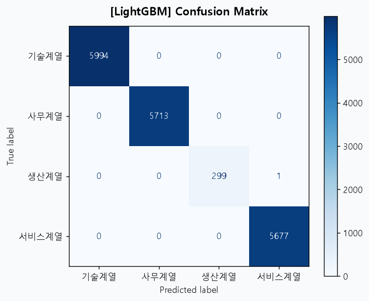
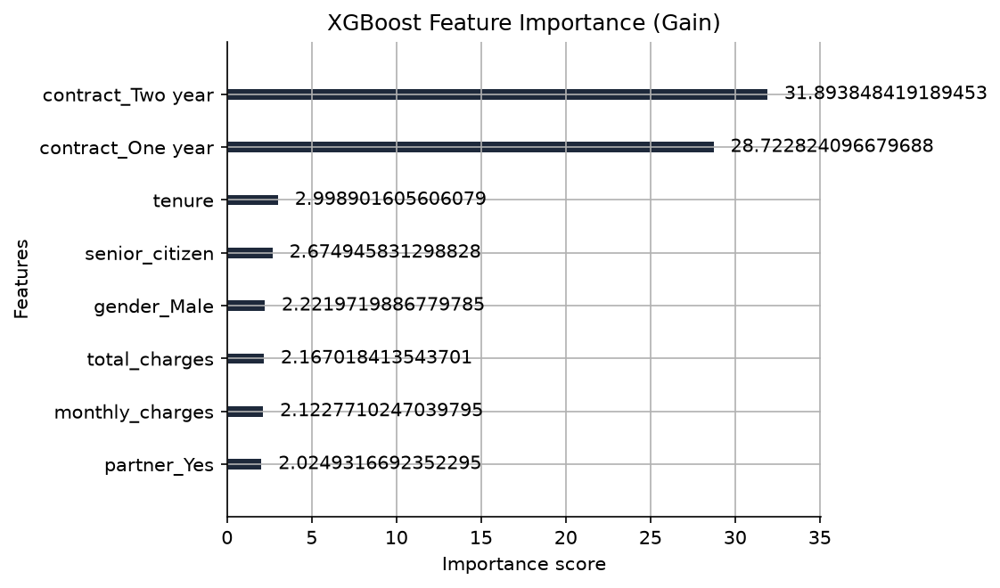
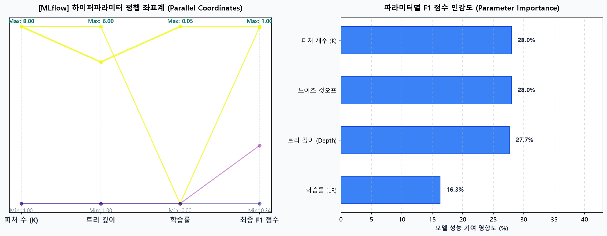

<div align="center">

# ⚡ Auto Data Analyzer & ML Scout

### **Turn any production database into an ML API and Executive-ready Presentation Deck in 60 seconds.**

*Safe Read-Only Profiling • Leak-Free Feature Engineering • 6-Model Tournament • One-Click FastAPI & PPTX Export*

<br/>

[](https://www.python.org/)
[](https://fastapi.tiangolo.com/)
[](https://streamlit.io/)
[](LICENSE)
[](tests/)

<br/>

**[ 🇰🇷 한국어 설명서 (Korean Documentation) ](README.ko.md)** • **[ 📖 Full Architecture Specs ](docs/24_데이터분석_파이프라인_도식_및_벤치마크.md)**

</div>

---

## 🌟 Why Auto Data Analyzer?

Most AutoML solutions are either **fragile scripts** that crash on dirty production tables, or **black-box SaaS tools** that require uploading your private customer data to third-party clouds.

**Auto Data Analyzer** is built from the ground up for enterprise data engineers and ML practitioners:
1. 🛡️ **Zero-Write Guarantee**: Read-only DB connection with `TABLESAMPLE BERNOULLI`. Guaranteed 0 write queries on your production warehouse.
2. 🔒 **Governance & Privacy**: Automatic PII masking, Two-Tier LOCO data-leakage barrier, and SVD multicollinearity suppression ($\kappa \le 15.0$).
3. 🏆 **Champion Tournament**: Evaluates 6 model families (LightGBM, XGBoost, Random Forest, MLP, GBDT, Baselines) using 10 metrics with 1,000 bootstrap iterations.
4. 🚀 **Production-Ready in Seconds**: Instantly generates an SLA < 50ms FastAPI service (`serve.py`), Dockerfile, and reproducible code (`reproduce.py`).
5. 📊 **Executive C-Level Deliverables**: Not just console logs — exports high-impact **16:9 widescreen PPTX presentation decks**, interactive HTML dashboards, and Excel data marts automatically.

---

## ⚡ 30-Second Quickstart

### 1. Installation
```bash
# Clone the repository
git clone https://github.com/your-org/auto-data-analyzer.git
cd auto-data-analyzer

# Install with uv (ultra-fast) or standard pip
uv sync
```

### 2. Launch Interactive Web UI
```bash
uv run streamlit run web.py
```
> Select a CSV file or enter a database connection string in the sidebar to start profiling and model discovery immediately.

### 3. Or Run via One-Liner CLI
```bash
# Analyze a CSV file & build churn prediction model + PPTX deck
uv run run.py --db-url "data/sample_customers.csv" --target "churn"

# Profile a live PostgreSQL table safely
uv run python src/main.py --config configs/db_config_postgres.yaml --table "customer_retention_mart" --target "is_churn"
```

---

## 🏗️ Architecture & Pipeline Flow

<div align="center">
  
</div>

<details>
<summary><b>🔍 Click to view interactive Mermaid pipeline diagram</b></summary>


</details>

---

## 📈 Proven Enterprise Benchmarks (1.25M Real Records)

Tested against official national AI-Hub datasets loaded into production PostgreSQL instances:

<div align="center">

| Dataset Domain | Rows | Target Column | Champion Model | Metric Score | Improvement vs Baseline |
| :--- | :---: | :--- | :---: | :---: | :---: |
| **Career Counseling & Recommendation** | 22,106 | `job_label` (Multi-class) | **LightGBM** | **0.9875** (F1) | **+86.78%** |
| **Student Educational Competency** | 335,436 | `data_type` (Binary) | **LogisticRegression** | **0.4894** (F1) | **+0.20%** |
| **Tabular QA & Validation** | 900,000 | `is_impossible` (Binary) | **ExtraTrees** | **0.7066** (F1) | **+1.46%** |

</div>

- **0 DDL/DML write events** executed on production databases.
- Automatic handling of class imbalance, high-cardinality categoricals, and multi-collinearity.
- Full artifacts generated in `< 3 minutes` per table.

---

## 🎁 What You Get (Generated Artifacts)

When the pipeline completes, your project workspace immediately receives:

```
dist/export_pipeline/
├── serve.py              # Production FastAPI server with <50ms SLA endpoint
├── best_model.joblib     # Serialized Champion model pipeline (Preprocessors + Estimator)
├── reproduce.py          # Standalone Python script to replicate training from scratch
├── Dockerfile            # Container deployment manifest ready for K8s / Cloud Run
└── reports/
    ├── executive_deck.pptx   # 16:9 Widescreen slide deck with charts & business summary
    ├── model_report.html     # Interactive dashboard with ROC curves, confusion matrices, SHAP
    └── profiling_mart.xlsx   # Cleaned feature profile and validation metrics
```

---

## 📊 Visualizations & Explainability (XAI) Out of the Box

Auto Data Analyzer automatically evaluates feature contributions, hyperparameters, and model errors without any manual matplotlib scripting:

<div align="center">

| **TreeSHAP Feature Impact (Beeswarm)** | **Confusion Matrix & Error Analysis** |
| :---: | :---: |
|  |  |

| **Feature Importance Ranking** | **Hyperparameter Coordinate Space** |
| :---: | :---: |
|  |  |

</div>

---

## 🗺️ Roadmap & Community vs Enterprise

We follow an **Open-Core** model. The core pipeline is free and open-source forever.

| Feature Area | Community Edition (Free OSS) | Enterprise Edition |
| :--- | :---: | :---: |
| **Data Sources** | CSV, SQLite, PostgreSQL | **Snowflake, BigQuery, Databricks, Redshift, Oracle, SAP** |
| **Pipeline Core** | Full LOCO Engine & 6-Model Scout | Full LOCO Engine & Distributed Hyperopt |
| **Outputs** | FastAPI, HTML, Standard PPTX | **Custom Branded C-Level PPTX (Your CI/Theme)** |
| **Security & Auth** | PII Masking, Read-Only Guards | **SSO (Okta/SAML), Role-Based Access Control (RBAC), Audit Logs** |
| **MLOps & Monitoring** | Single-node export | **Automated Data Drift Watcher & Scheduled Continuous Retraining** |
| **LLM Agent Add-on** | Community prompt template | **Natural Language "Ask your DB" Executive Agent** |

> 💬 **Interested in Enterprise Early Access or Custom B2B PoC?**  
> Contact our engineering team at `contact@yourdomain.com` or open an [Enterprise Inquiry Discussion](https://github.com).

---

## 🤝 Contributing

Contributions are welcome! Please see our [Contributing Guide](CONTRIBUTING.md) and [Branch Strategy](docs/09_깃허브_브랜치_전략_및_PR_정책.md).

1. Fork the Project
2. Create your Feature Branch (`git checkout -b feat/AmazingFeature`)
3. Commit your Changes (`git commit -m 'feat: Add some AmazingFeature'`)
4. Push to the Branch (`git push origin feat/AmazingFeature`)
5. Open a Pull Request

---

## 📜 License

Distributed under the Apache 2.0 License. See [LICENSE](LICENSE) for more information.

<div align="center">
  <sub>Built with care for data teams worldwide. Star ⭐ this repository if you find it helpful!</sub>
</div>
