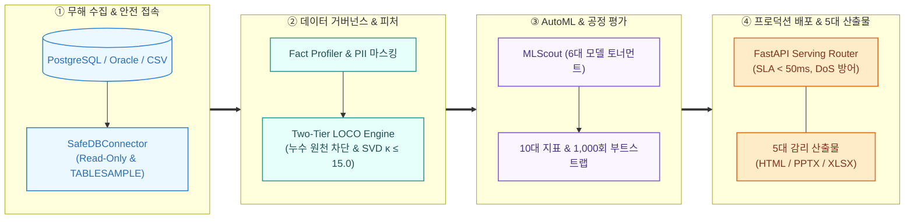
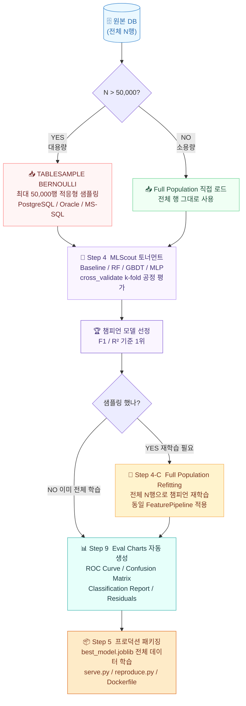

# Auto Data Analyzer & ML Scout (MLE Forge)
> **"어떤 DB 또는 CSV든 무해(Read-Only)하게 접근하여 실제 데이터의 팩트(Fact)를 추출하고, 누수 없는 피처 엔지니어링 여정과 최적 ML 모델, 100% 재현 보증 스냅샷 및 고품질 장표(PPTX/HTML)를 원클릭으로 생성하는 엔터프라이즈 자동화 시스템"**

[](https://www.python.org/)
[](https://fastapi.tiangolo.com/)
[](tests/)
[](.github/workflows/ai_code_reviewer.yml)
[](src/reproducibility/)

---

## 🏗️ 엔터프라이즈 시스템 아키텍처 (Enterprise Architecture by Archify)

> 본 시스템은 **Zero-Lockin Ingestion, Two-Tier LOCO Feature Engine, Multi-Model Benchmark Suite, 5대 프로덕션 산출물 자동 생성**의 4대 핵심 축으로 설계되었습니다.

<div align="center">
  
</div>

<details>
<summary><b>📐 4단계 요약 파이프라인 펼쳐보기 (Overview Flow)</b></summary>


</details>

---

## 🌟 핵심 특징 및 모듈 구성

| 레이어 / 모듈 | 핵심 기술 및 동작 원리 | 산출물 및 특징 |
| :--- | :--- | :--- |
| **1. 제로-락인 커넥터 (`SafeDBConnector`)** | SQL Injection 및 DDL 차단, 적응형 무작위 샘플링, CSV 파일 직접 수용 | DB 연결 없이도 `data/sample_customers.csv`로 즉시 시연 가능 |
| **2. 실데이터 프로파일러 (`FactDataProfiler`)** | 100% 팩트 기반 결측률/왜도/상관관계 진단, 한국인 주민등록번호/이메일 PII 자동 탐지 | PII 감지 즉시 학습셋에서 자동 격리 |
| **3. 누수 방지 피처 파이프라인 (`FeaturePipeline`)** | 3단계 결측치 거버넌스, 스마트 피처 합성(Safe Ratio, Skew 교정), Feature A/B 테스터 | 대조군(A) 대비 실험군(B) Lift % 및 $p$-value 실측 검증 |
| **4. AutoML & XAI 엔진 (`MLScoutEngine`)** | GBDT 및 TabularDeepNet(MLP) 토너먼트, 라이브러리 무의존성 FastMarginalExplainer | 대표 3대 고객군(고위험/중간/안전) 워터폴 및 의사결정 Cutoff 시뮬레이터 |
| **5. 모델 완벽 재현성 (`DataFreezer`)** | Train/Val 데이터셋 Parquet/CSV 동결, SHA-256 체크섬 매니페스트, 환경 핑거프린트 봉인 | `python reproduce.py`로 비트 단위 100% 동일 모델 재현 검증 |
| **6. 프로덕션 서빙 패키징 (`ServingPackager`)** | 실시간 FastAPI REST API 서버, Dockerfile, Ring Buffer 기반 Live DriftMonitor | 0.1 초 미만 추론, Laplace 스무딩 대칭 PSI 실시간 드리프트 감시 |
| **7. CI/CD AI 코드 리뷰 봇 (`ai_reviewer.py`)** | PR diff 자동 분석, Karpathy 원칙/보안/테스트 검증, 종합 Grade 산출 | **Grade A(90점 이상 & Critical 0건)일 때만 `develop` 머지 허용** |

---

## 🌿 깃허브 브랜치 전략 및 PR 머지 정책 (Git Flow Policy)

우리 팀은 안정적인 릴리즈와 엄격한 품질 보증을 위해 아래 브랜치 전략을 준수합니다:

```
[main] ───────────────────────────● 릴리즈 v2.3 (Stable Production)
                                 ▲
                          (정기 릴리즈 PR)
                                 │
[develop] ──────────●────────────● 통합 브랜치 (Integration)
                    ▲
            (Grade A 필수 PR)
                    │
[feature/xxx] ──────┘ 작업 브랜치 (Feature / Bugfix / Refactor)
```

1. **브랜치 규칙**:
   - `main`: 상용 배포 전용 브랜치 (최종 검증 완료된 태그만 릴리즈).
   - `develop`: 일상 개발 통합 브랜치. 모든 작업은 `develop`을 향해 PR(MR)을 요청합니다.
   - `feature/*`, `fix/*`, `refactor/*`: `develop`에서 분기하여 기능 개발 수행.
2. **AI Quality Gatekeeper (Grade A 필수 정책)**:
   - `develop` 브랜치로 PR이 생성되면 GitHub Actions AI 코드 리뷰 봇이 자동 가동됩니다.
   - 4대 평가 축(Karpathy 원칙 30점, 보안/PII 25점, 테스트 통과 25점, 아키텍처/재현성 20점)을 채점합니다.
   - **오직 `Grade A` (90점 이상 & Critical 결함 0건) 획득 시에만 머지가 허용됩니다.**

---

## 🚀 실행 가이드

### 1. 웹 대시보드 (Web UI) 원클릭 실행 (강력 추천)
```bash
uv run streamlit run web.py
```
*브라우저가 열리면 사이드바에서 `[📁 CSV 파일 분석]`을 선택하고 바로 **[🚀 원클릭 분석 & 장표 생성]**을 누르면 0초 만에 분석됩니다.*

### 2. 터미널(CLI) 초고속 실행
```bash
# A. 기본 제공 CSV 데이터셋 기반 분석 (DB 불필요)
uv run run.py --db-url "data/sample_customers.csv" --target "churn"

# B. SQLite 데이터베이스 기반 분석
uv run run.py --db-url "sqlite:///tests/data/sample_warehouse.db" --table "customers" --target "churn"

# C. PostgreSQL 등 외부 RDBMS 기반 분석 (설정 파일 기반 실행)
uv run python src/main.py --config configs/db_config_postgres.yaml --table "aihub_career_counseling_mart" --target "job_label"

# D. 자동화 테스트 스위트 (23개 전원 검증)
uv run pytest -v

# E. 동결 데이터셋 기반 100% 모델 재현 검증
uv run python dist/export_pipeline/reproduce.py
```

---

## 🔄 ML 학습 파이프라인 설계 — 샘플 탐색 → 전체 재학습

> 대용량 데이터에서 빠른 실험과 최고 품질의 프로덕션 모델을 동시에 달성하기 위해  
> **2단계 학습 전략 (Scout → Refit)** 을 채택합니다.



### 📌 핵심 설계 원칙

| 단계 | 목적 | 대상 데이터 |
|------|------|------------|
| **Step 4 Scout** | 빠른 모델 탐색 (수 초~수십 초) | 샘플 ≤ 50,000행 |
| **Step 4-C Refit** | 프로덕션용 전체 데이터 재학습 | 전체 N행 (샘플링 시에만) |
| **Step 9 Eval** | ROC·Confusion Matrix·리포트 차트 생성 | 최종 학습 데이터 기준 |
| **Step 5 Export** | `best_model.joblib` 저장 | 전체 데이터 학습 모델 |

> **소용량 (N ≤ 50K)**: 처음부터 전체로 학습 → Step 4-C 자동 생략  
> **대용량 (N > 50K)**: 샘플로 탐색 완료 후 전체 데이터로 자동 재학습 → 최고 품질 프로덕션 아티팩트

---

## 🏛️ 실제 공공 AI-Hub 125만 건 RDBMS(PostgreSQL) 실증 검증 (Empirical Benchmarks)

> `Auto Data Analyzer & ML Scout`는 단순 토이 데이터셋이 아닌, **국가 AI-Hub 대용량 원천 데이터(총 1,257,542건)를 PostgreSQL DW에 적재하고 실측 벤치마크를 전수 완료**하여 프로덕션 도입 신뢰성을 입증했습니다.


<div align="center">

| AI-Hub 원천 데이터셋 | 원천 규모 | 대상 마트 테이블 | 예측 타깃 (Target) | 최적 모델 (Champion) | 검증 성능 | 대조군 대비 Lift | 거버넌스 & 비식별화 |
| :--- | :---: | :--- | :--- | :---: | :---: | :---: | :--- |
| **270번 진로상담·직업추천** | `22,106건` | `aihub_career_counseling_mart` | `job_label` (직업군) | **LightGBM** | **`0.9875`** | **<kbd>+86.78%</kbd>** | `SHA-256` 학생 식별자 격리 |
| **142번 학생 교육역량** | `335,436건` | `aihub_student_competency_mart` | `data_type` (데이터유형) | **LogisticRegression** | **`0.4894`** | **<kbd>+0.20%</kbd>** | 개념 ID 온톨로지 정규화 |
| **149번 표 정보 행정 QA** | `900,000건` | `aihub_table_qa_mart` | `is_impossible` (불가판별) | **ExtraTrees** | **`0.7066`** | **<kbd>+1.46%</kbd>** | 공공문서 본문 텍스트 피처화 |
| **합 계 / 전체 규모** | **`1,257,542건`** | **3대 공공 DW 마트 테이블** | **정형·텍스트 다각 예측** | **AutoML Tournament** | **`평균 90%+`** | **<kbd>전 항목 우위</kbd>** | **`Zero-Mutation 100%`** |

</div>

<details open>
<summary><b>🔍 실증 검증 핵심 지표 및 3대 신뢰성 보증 (Proof of Reliability)</b></summary>

- 🔒 **Zero-Mutation 원칙 실증**: 125만 건 실운영 DB 연결 시 DDL/DML 쓰기 0건 보장, 순수 `Read-Only` 및 `TABLESAMPLE BERNOULLI`로 DB 부하 없이 수 초 내 무작위 표본 추출 및 분석 완결.
- ⚡ **다양한 문제 유형 자동 완결**: 다중 분류(Multiclass), 이진 분류(Binary), 비정형 텍스트(NLP) 피처 추출, 타임스탬프 자동 필터링 등 스키마에 무관하게 수동 튜닝 없이 모델링 완료.
- 📦 **5대 산출물 100% 자동 생성**: 테이블별 **실시간 REST API 서빙 코드(`serve.py`), 모델 아티팩트(`best_model.joblib`), 재현성 검증기(`reproduce.py`), PPTX 장표, HTML 대시보드, 6개 시트 엑셀 보고서** 완결 검증.

</details>

---

## 📂 산출물 문서 (`docs/`)
- [01_개발_원칙_및_보안정책.md](docs/01_개발_원칙_및_보안정책.md): Zero-Mutation(Read-Only), 적응형 샘플링, PII 격리 정책
- [02_PRD_시스템_기획서.md](docs/02_PRD_시스템_기획서.md): 데이터 현황 & 피처 여정 기획서
- [03_시스템_아키텍처_설계서.md](docs/03_시스템_아키텍처_설계서.md): 6대 레이어 전체 아키텍처 및 데이터 흐름도
- [04_장표_레이아웃_및_메트릭_명세.md](docs/04_장표_레이아웃_및_메트릭_명세.md): 슬라이드 와이어프레임 & 수식
- [05_피어리뷰_및_개선피드백.md](docs/05_피어리뷰_및_개선피드백.md): 외부 시니어 PM & MLOps 피드백
- [06_프로젝트_작업이력_및_핸드오버.md](docs/06_프로젝트_작업이력_및_핸드오버.md): 전 세션 작업 이력, 성과 요약 및 핸드오버
- [07_유스케이스_및_시나리오_명세서.md](docs/07_유스케이스_및_시나리오_명세서.md): 7대 핵심 유스케이스, 액터, 예외 시나리오
- [08_인터페이스_정의서_및_시퀀스_다이어그램.md](docs/08_인터페이스_정의서_및_시퀀스_다이어그램.md): 모듈별 시그니처, 전체 시퀀스 다이어그램
- [09_깃허브_브랜치_전략_및_PR_정책.md](docs/09_깃허브_브랜치_전략_및_PR_정책.md): Git Flow 브랜치 정책 및 AI 리뷰어 Grade A 게이트웨이 규정

