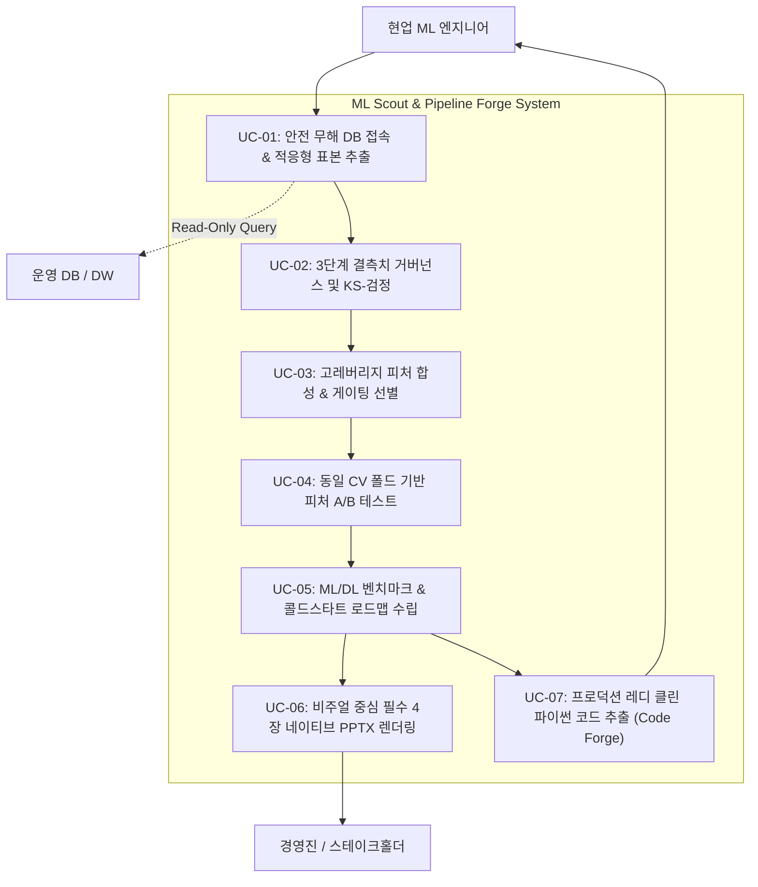

# [개발 산출물] 07. 유스케이스 및 시나리오 명세서 (Use Case Specification)

- **프로젝트명:** ML Scout & Pipeline Forge (Auto Data Analyzer)
- **작성 주체:** 특급 기획자 & 시니어 AI 엔지니어
- **문서 버전:** v2.0 (피처 합성, 결측치 거버넌스, 피처 A/B 테스트, 콜드스타트 로드맵, 클린 코드 추출 반영)

---

## 1. 액터(Actor) 정의

| 액터 | 역할 및 주요 목표 | 시스템과의 주 접점 |
| :--- | :--- | :--- |
| **현업 ML 엔지니어 (Primary)** | 반복적인 전처리, EDA, 장표 작성 시간을 80% 줄이고, 데이터 체질에 맞는 모델과 프로덕션 파이프라인 코드를 획득 | CLI (`run.py`), Web UI, 코드 산출물 (`export_pipeline/`) |
| **비즈니스 기획자 / PM** | 분석 결과의 타당성(피처 선정 논리, A/B 테스트 증빙)을 확인하고 의사결정 | 필수 4장 PPTX 장표, Streamlit 웹 대시보드 |
| **경영진 / 스테이크홀더** | 데이터 품질 건전성 및 데이터 성장 단계별 인프라/모델 투자 로드맵 파악 | PPTX 슬라이드 1, 3, HTML 총괄 리포트 |
| **운영 데이터베이스 (DW/RDBMS)** | 분석 대상 원천 데이터를 제공하는 소속 엔터프라이즈 시스템 (부하 최소화 대상) | SQLAlchemy Read-Only 커넥터 |

---

## 2. 유스케이스 다이어그램 (Use Case Diagram)

---

## 3. 핵심 유스케이스 상세 명세

### [UC-01] 안전 무해 DB 접속 및 대용량 적응형 표본 추출
* **주 액터:** 현업 ML 엔지니어
* **사전 조건(Pre-conditions):**
  * 유효한 데이터베이스 연결 문자열(SQLAlchemy 포맷: SQLite, PostgreSQL, MySQL 등) 제공
* **기본 흐름(Main Flow):**
  1. 시스템은 DB 연결 시 드라이버 레벨에서 `READ ONLY` 트랜잭션을 강제 활성화한다.
  2. 시스템은 대상 테이블의 전체 레코드 수($N$)를 `SELECT COUNT(*)`로 조회한다.
  3. $N \le 50,000$인 경우 전수 데이터를 메모리로 로드한다.
  4. $N > 50,000$인 경우, 통계적 유의수준 99%를 보증하는 계층적 적응형 표본추출(Adaptive Stratified Sampling)을 수행하여 DB 부하를 0으로 억제한다.
  5. 메모리 점유율(MB)을 계산하여 OOM 안전 한도 내에 있는지 검증한다.
* **사후 조건(Post-conditions):**
  * 원천 데이터의 불변성(Zero-Mutation)이 100% 보증된 DataFrame 생성.

---

### [UC-02] 3단계 결측치 거버넌스 및 KS-검정 (Missing Governance)
* **주 액터:** 시스템 (자동 수행)
* **사전 조건:** 로드된 원천 데이터셋 수신
* **기본 흐름:**
  1. 각 컬럼의 결측치 비율을 측정하여 3단계로 자동 분류한다:
     * **경미 (<5%):** Train 중앙값/최빈값 대체.
     * **중간 (5%~40%):** 결측 정보 유실 방지를 위해 `{col}_is_missing` 이진 지시자 플래그 생성 후 대체.
     * **극심 (≥40%):** 결측 지시자 플래그 생성 및 심각 결측 처리.
  2. 수치형 대체 컬럼에 대해 Kolmogorov-Smirnov 검정(KS-test)을 수행하여 원본 분포와 대체 후 분포의 동질성($p \ge 0.01$)을 검증한다.
* **대체 흐름:**
  * 만약 KS-test 실패 시, 데이터 왜곡 위험 플래그를 감사 로그에 기록하고 보고서에 경고를 표기한다.

---

### [UC-03] 고레버리지 피처 합성 & 게이팅 선별 (Smart Feature Synthesis)
* **주 액터:** 시스템 (자동 수행)
* **사전 조건:** 결측치가 정제된 Train 세트 및 타겟 레이블 수신
* **기본 흐름:**
  1. **왜도 교정 변환:** 왜도 $|skew| > 1.5$인 비대칭 수치형 변수에 `log1p(x)` 변환 피처 자동 생성.
  2. **수치형 상호작용 비율:** 주요 수치형 변수 쌍 간 `Safe Division`($\epsilon = 10^{-6}$) 기반 비율(`ratio_A_div_B`) 피처 생성.
  3. **그룹별 상대 편차:** 주요 범주형 변수의 집단 평균을 Train 세트에서 계산하고, `x - GroupMean(x by category)` 상대 편차 피처 생성.
  4. **게이팅 필터 (Feature Gating):** 상호정보량(Mutual Information) 평가를 거쳐 타겟 예측 기여도가 가장 높은 상위 6개 황금 피처만 최종 선발하고 노이즈 피처는 탈락 처리한다.
* **사후 조건:**
  * 선발된 합성 피처의 수식 및 선정 이유가 감사 로그(`feature_synthesis_audit`)에 기계적으로 기록된다.

---

### [UC-04] 동일 CV 폴드 기반 피처 A/B 테스트 검증 (Feature A/B Benchmark)
* **주 액터:** 시스템 (자동 수행)
* **목적:** 엔지니어에게 **"이 피처들을 왜 넣었는가?"**에 대한 무적의 논리적/통계적 증빙 제공
* **기본 흐름:**
  1. 동일한 Random Seed 및 Stratified 5-Fold 교차검증 분할을 고정한다.
  2. **대조군(Group A):** 원본 데이터에 최소한의 기본 전처리만 적용한 피처셋으로 모델을 학습/평가한다.
  3. **실험군(Group B):** 결측 지시자 + 합성 피처 + 게이팅 선별이 적용된 피처셋으로 동일 모델을 학습/평가한다.
  4. 폴드별 점수를 비교하여 평균 성능 리프트(Lift %) 및 대응표본 t-검정(Paired t-test) $p$-value를 계산한다.
  5. 통계적 유의성(`p < 0.05`)과 5개 폴드 중 B군의 승리 횟수를 산출한다.
* **사후 조건:**
  * 장표 Slide 2 및 보고서에 삽입될 정면 비교 차트 및 결론 문장 자동 생성.

---

### [UC-05] ML/DL 벤치마크 & 데이터 수명주기(콜드스타트) 로드맵 수립
* **주 액터:** 현업 ML 엔지니어 / 스테이크홀더
* **기본 흐름:**
  1. 데이터 크기($N, P$), 희소성(Sparsity), 불균형도를 기반으로 **데이터 DNA**를 진단한다.
  2. 데이터 규모에 따라 현재 라이프사이클 단계를 판정한다:
     * **Phase 1 (Cold Start, $N < 5,000$):** TabPFN, Regularized Linear, Small RF 추천 (과적합 억제).
     * **Phase 2 (Growth, $5,000 \le N < 50,000$):** LightGBM, CatBoost, XGBoost GBDT 추천.
     * **Phase 3 (Scale-Up, $N \ge 50,000$):** FT-Transformer(Tabular DL), TabNet, Stacking 추천.
  3. 모델 풀(Linear, RF, ExtraTrees, HistGBM, LightGBM, TabularDeepNet) 간 교차검증 아레나를 거쳐 1위 승자 모델을 확정한다.
  4. 데이터가 더 축적되었을 때의 차기 마이그레이션 전략을 담은 **3단계 로드맵**을 수립한다.

---

### [UC-06] 비주얼 중심 필수 4장 네이티브 PPTX 장표 렌더링
* **주 액터:** 비즈니스 기획자 / 경영진
* **기본 흐름:**
  1. 시스템은 텍스트 나열을 최소화하고, Matplotlib 기반 고해상도 시각화 차트를 자동 생성한다:
     * Slide 1: 결측치 거버넌스 등급 차트 + 건전성 스코어카드
     * Slide 2: 5-Fold A/B 테스트 정면 비교 바 차트 + 합성 피처 내역 카드
     * Slide 3: 모델 리더보드 가로 막대 차트 + 3단계 진화 로드맵 다이어그램
     * Slide 4: Top 8 피처 중요도 랭킹 차트 + 실무 제언 인포그래픽 박스
  2. 16:9 와이드스크린 네이티브 PPTX 파일로 저장하여, 발표자가 텍스트와 도형을 100% 수정 가능하도록 제공한다.

---

### [UC-07] 프로덕션 레디 클린 파이썬 코드 추출 (Code Forge)
* **주 액터:** 현업 ML 엔지니어
* **기본 흐름:**
  1. 블랙박스 없는 순수 scikit-learn 커스텀 트랜스포머(`AutoFeatureSynthesizer`, `MissingManager`) 파이프라인(`pipeline.py`) 생성.
  2. A/B 테스트 재현 플래그(`--run-ab-test`)가 내장된 학습 스크립트(`train.py`) 생성.
  3. 신규 단일/배치 레코드를 즉시 추론할 수 있는 추론 스크립트(`inference.py`) 생성.
  4. 엔지니어가 회사 저장소에 즉시 커밋할 수 있도록 `export_pipeline/` 폴더에 패키징.
