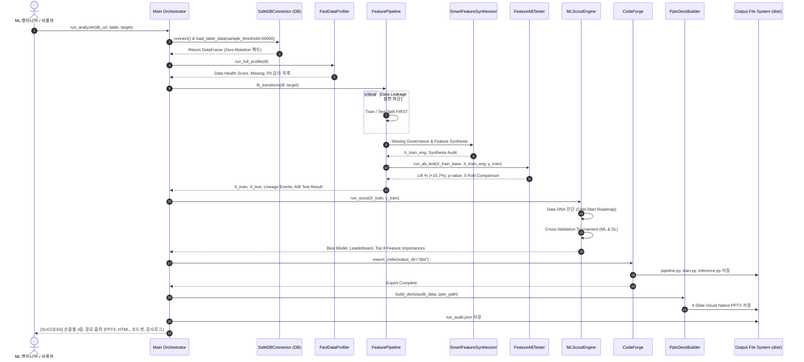
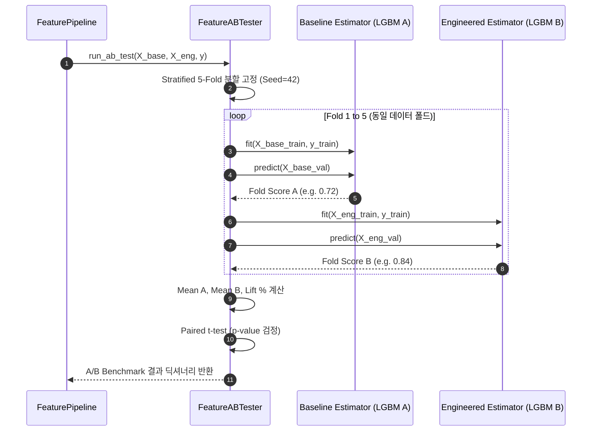

# [개발 산출물] 08. 인터페이스 정의서 및 시퀀스 다이어그램 (Interface Spec & Sequence Diagrams)

- **프로젝트명:** ML Scout & Pipeline Forge
- **작성 주체:** 특급 기획자 & 시니어 AI 엔지니어
- **문서 버전:** v2.0

---

## 1. 모듈별 인터페이스 정의서 (Module Interface Contracts)

### 1.1 `SafeDBConnector` (안전 무해 DB 커넥터)
* **모듈 위치:** `src.connectors.safe_connector.SafeDBConnector`
* **주요 메서드:**
  ```python
  def __init__(self, db_url: str):
      """DB 엔진을 판별하고 드라이버 레벨에서 Read-Only 격리 수준을 설정한다."""
      
  def get_table_names(self) -> List[str]:
      """스키마 내 존재하는 모든 테이블 명칭을 반환한다."""
      
  def load_table_data(self, table_name: str, sample_threshold: int = 50000) -> Dict[str, Any]:
      """
      대용량 적응형 표본 추출을 수행한다.
      - Returns: {
          "data": pd.DataFrame,
          "total_rows": int,
          "sample_rows": int,
          "is_sampled": bool,
          "memory_mb": float
      }
      """
  ```

---

### 1.2 `MissingGovernance` (3단계 결측치 관리 엔진)
* **모듈 위치:** `src.pipeline.feature_synthesizer.MissingGovernance`
* **주요 메서드:**
  ```python
  def fit_transform(self, X: pd.DataFrame, y: Optional[pd.Series] = None) -> pd.DataFrame:
      """
      결측 비율에 따라 3단계로 분기 처리하고 지시자 플래그를 생성한다.
      - 결측 < 5%: Train 중앙값/최빈값 대체 + KS-test 분포 검증
      - 5% ≤ 결측 < 40%: 결측 지시자(_is_missing) 생성 + 대체
      - 결측 ≥ 40%: 결측 지시자 생성 + 극심 결측 처리
      - Returns: 정제된 DataFrame (누수 제로)
      """

  def transform(self, X: pd.DataFrame) -> pd.DataFrame:
      """신규 추론 데이터에 동일한 결측 지시자 및 중앙값을 주입한다."""
  ```

---

### 1.3 `SmartFeatureSynthesizer` (고레버리지 피처 합성 & 게이팅)
* **모듈 위치:** `src.pipeline.feature_synthesizer.SmartFeatureSynthesizer`
* **주요 메서드:**
  ```python
  def fit_transform(
      self, 
      X: pd.DataFrame, 
      y: Optional[pd.Series] = None
  ) -> Tuple[pd.DataFrame, List[Dict[str, Any]]]:
      """
      왜도 log1p 변환, 수치형 비율(Safe Div), 범주형 그룹 평균 편차를 합성한 후
      상호정보량(MI) 기반 게이팅 필터로 상위 K개 황금 피처만 선발한다.
      - Returns: (합성 피처가 추가된 DataFrame, 선발/탈락 감사 내역 리스트)
      """

  def transform(self, X: pd.DataFrame) -> pd.DataFrame:
      """신규 데이터에 선발된 수식만을 재현하여 변환한다."""
  ```

---

### 1.4 `FeatureABTester` (동일 CV 폴드 기반 피처 A/B 테스트 엔진)
* **모듈 위치:** `src.pipeline.feature_ab_tester.FeatureABTester`
* **주요 메서드:**
  ```python
  def run_ab_test(
      self,
      X_base: pd.DataFrame,
      X_eng: pd.DataFrame,
      y: pd.Series,
      task_type: str = "Binary_Classification"
  ) -> Dict[str, Any]:
      """
      동일한 Stratified 5-Fold 상에서 대조군(A)과 실험군(B)을 1:1 대결시킨다.
      - Returns: {
          "metric_name": str,
          "group_a": {"name": str, "mean_score": float, "fold_scores": List[float]},
          "group_b": {"name": str, "mean_score": float, "fold_scores": List[float]},
          "lift_pct": float,
          "p_value": float,
          "is_statistically_significant": bool,
          "folds_won_by_b": str,
          "conclusion": str
      }
      """
  ```

---

### 1.5 `MLScoutEngine` & `DataDNAProfiler` (확장 모델 풀 및 수명주기 로드맵)
* **모듈 위치:** `src.ml_scout.engine.MLScoutEngine`
* **주요 메서드:**
  ```python
  def run_scout(self, X_train: pd.DataFrame, y_train: pd.Series) -> Dict[str, Any]:
      """
      1. DataDNAProfiler로 데이터 규모(N, P), 희소성, 불균형도를 분석하여 콜드스타트 진화 로드맵 도출
      2. Baseline, Ensemble, GBDT, TabularDeepNet(MLP) 간 교차검증 토너먼트 진행
      3. 1위 승자 모델 확정 및 피처 중요도(Feature Importance) 추출
      """
  ```

---

### 1.6 `CodeForge` & `ServingPackager` (순수 파이썬 코드셋 & 실시간 서빙 생성기)
* **모듈 위치:** `src.pipeline.code_forge.CodeForge` & `src.serving.api_packager.ServingPackager`
* **주요 메서드:**
  ```python
  class ServingPackager:
      def package(
          self,
          export_dir: str,
          model_instance: Any,
          selected_features: List[str],
          target_column: str,
          task_type: str,
          model_name: str,
          feature_sample: Optional[pd.DataFrame] = None,
          metrics: Optional[Dict[str, Any]] = None
      ) -> Dict[str, str]:
          """
          1. best_model.joblib 바이너리 직렬화 저장
          2. metadata.json 생성 (피처 리스트, 타겟, 평가지표)
          3. serve.py 생성: Pydantic v2 기반 실시간 /predict 및 /predict/batch FastAPI 엔드포인트
          4. Dockerfile 생성: 프로덕션 경량 컨테이너 패키징
          5. test_client.py 생성: 자동화 REST API 엔드포인트 검증 스크립트
          """
  ```

---

## 2. 전체 엔드투엔드 시퀀스 다이어그램 (End-to-End Sequence Diagram)



---

## 3. 피처 A/B 테스트 내부 실행 시퀀스 다이어그램



---

## 4. SSOT 감사 로그 (`run_audit.json`) v2.0 스키마 명세

시스템의 모든 산출물(PPTX, HTML, 코드)은 오직 아래 단일 진실 공급원(SSOT) 데이터만 파싱하여 생성되므로 100% 거짓말(Hallucination)이 불가능합니다:

```json
{
  "$schema": "http://json-schema.org/draft-07/schema#",
  "type": "object",
  "properties": {
    "audit_version": { "type": "string", "example": "2.0.0" },
    "generated_at": { "type": "string", "format": "date-time" },
    "checksum": { "type": "string" },
    "db_meta": {
      "type": "object",
      "properties": {
        "engine": { "type": "string" },
        "target_table": { "type": "string" },
        "total_row_count": { "type": "integer" },
        "sample_row_count": { "type": "integer" },
        "is_sampled": { "type": "boolean" },
        "memory_mb": { "type": "number" }
      }
    },
    "data_health": {
      "type": "object",
      "properties": {
        "health_score": { "type": "integer" },
        "total_columns": { "type": "integer" },
        "missing_cells_ratio": { "type": "number" },
        "duplicate_row_count": { "type": "integer" },
        "pii_detected": { "type": "array" },
        "high_correlation_pairs": { "type": "array" }
      }
    },
    "feature_ab_test": {
      "type": "object",
      "properties": {
        "metric_name": { "type": "string" },
        "group_a": { "type": "object" },
        "group_b": { "type": "object" },
        "lift_pct": { "type": "number" },
        "p_value": { "type": "number" },
        "is_statistically_significant": { "type": "boolean" },
        "folds_won_by_b": { "type": "string" },
        "conclusion": { "type": "string" }
      }
    },
    "feature_synthesis_audit": {
      "type": "array",
      "items": {
        "type": "object",
        "properties": {
          "feature_name": { "type": "string" },
          "type": { "type": "string" },
          "formula": { "type": "string" },
          "rationale": { "type": "string" },
          "selected": { "type": "boolean" }
        }
      }
    },
    "ml_scout": {
      "type": "object",
      "properties": {
        "task_type": { "type": "string" },
        "primary_metric": { "type": "string" },
        "best_model": { "type": "string" },
        "data_dna": {
          "type": "object",
          "properties": {
            "current_phase": { "type": "string" },
            "recommended_family": { "type": "string" },
            "roadmap": { "type": "object" }
          }
        },
        "leaderboard": { "type": "array" },
        "top_features": { "type": "array" }
      }
    }
  }
}
```
