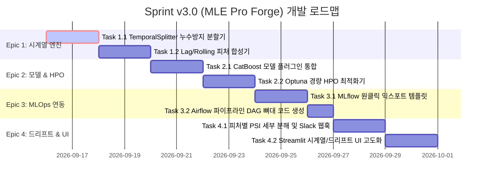

# [회의록 & 업무정의서] ML 엔지니어 인터뷰 기반 제품 고도화 정의서
- **문서 번호:** DOC-20260915-MLE-01
- **작성 일시:** 2026-09-15 23:35 (KST)
- **참여 주체:** 5인 특급 스쿼드 (Lead PO, Frontend Lead, Server/MLOps Lead, UI/UX Pub, Growth Marketer) & 외부 현직 시니어 ML 엔지니어
- **적용 프로젝트:** `Auto Data Analyzer & ML Scout (MLE Forge)` (`D:\workspace\auto-data-analyzer`)

---

## 1. 🤝 현직 실무 ML 엔지니어(MLE) 인터뷰 & 페인포인트 청취

### 📋 인터뷰 대상 페르소나
* **인터뷰 대상:** 김태호 님 (7년차 시니어 MLOps & ML 엔지니어 / 테크 플랫폼사 근무)
* **주요 업무:** 유저 행동 로그 기반 실시간 이탈/전환 예측 모델 개발, 피처 스토어 운영 및 서빙 파이프라인 관리
* **제품 사전 사용 범위:** `SafeDBConnector`로 고객 데이터(5,000건 CSV 및 SQLite) 로드, 피처 A/B 테스트, LightGBM/DeepNet 학습, FastAPI 서빙 및 100% 재현성 검증 실행

---

### 💬 인터뷰 상세 Q&A 및 실무 애로사항

#### Q1. 현재 제품을 처음 써보았을 때 가장 인상 깊었던 점과, 반대로 실무 도입을 망설이게 만드는 가장 큰 단점은 무엇인가요?
> **김태호 MLE:**
> "우선 **'Zero-Lockin Read-Only 가드'**와 **'100% 비트 단위 재현성(DataFreezer)'**, 그리고 scikit-learn 순수 파이프라인 코드를 뱉어주는 건 정말 감탄했습니다. 시중의 많은 AutoML 툴들은 프레임워크 자체의 종속성이 너무 심해서 실무에 못 쓰는데, 이건 순수 파이썬 코드로 익스포트되니까요.
> 
> 하지만 **실무 데이터의 80%는 일자/시간(timestamp)이 있는 시계열(Time-Series)이나 트랜잭션 데이터**라는 점입니다. 지금 시스템은 날짜 컬럼을 단순 범주형으로 보거나 무시하고, 데이터를 무작위 Stratified 5-Fold로 쪼갭니다.
> **시계열 데이터에서 랜덤 K-Fold를 쓰면 미래의 데이터가 과거 학습에 유입되는 '미래 정보 누수(Look-ahead bias / Data Leakage)'가 발생**합니다. 연구실에서는 AUC 0.95가 나와도 실서버에 올리면 성능이 처참하게 망가집니다. 시계열 분할(TimeSeriesSplit)과 시간 기반 래깅(Lag/Rolling) 피처가 빠져 있는 것이 가장 큰 아쉬움입니다."

#### Q2. 모델 탐색(ML Scout Engine)과 하이퍼파라미터 튜닝 측면에서 실무적인 불편함은 어떠했나요?
> **김태호 MLE:**
> "현재는 LightGBM, HistGBDT, RandomForest, 기본 TabularDeepNet(MLP) 4종이 고정된 기본 하이퍼파라미터로만 겨룹니다.
> 그런데 정형 데이터 실무에서는 범주형(카테고리) 변수가 수십 개씩 섞여 있을 때 **CatBoost**가 튜닝 없이도 LightGBM보다 훨씬 강력한 성능을 내는 경우가 많습니다. 또 **XGBoost**는 금융/리스크 도메인의 사실상 표준이고요.
> 특히 모델 간 토너먼트에서 **Optuna 같은 경량 Bayesian 하이퍼파라미터 최적화(HPO)**가 전혀 돌지 않으니, '초기 탐색용 베이스라인' 이상의 성능을 뽑아내기 어렵습니다. 1~3분 정도 제한 시간을 두고 상위 1~2개 후보 모델의 하이퍼파라미터를 자동으로 튜닝해 주는 모드가 절실합니다."

#### Q3. MLOps 및 협업 워크플로우(실험 추적, 파이프라인 연동)에서의 보완점은 무엇인가요?
> **김태호 MLE:**
> "익스포트되는 `train.py`와 `pipeline.py`가 깔끔하긴 하지만, 사내 팀원들과 협업할 때는 **MLflow**나 **Weights & Biases(W&B)**로 파라미터, 메트릭, 혼동 행렬(Confusion Matrix), 모델 바이너리를 원격 로깅하는 것이 표준입니다.
> 현재는 로컬의 `run_audit.json`에만 기록되다 보니, 다른 팀원들이 실험 결과를 대시보드로 함께 비교하기 어렵습니다. `train.py`에 `--enable-mlflow` 같은 원클릭 스위치와 기본 메트릭 로깅 템플릿이 자동으로 박혀 있으면 작업 시간을 며칠씩 아낄 수 있습니다."

#### Q4. 프로덕션 서빙과 드리프트 모니터링(DriftMonitor)을 보셨을 텐데, 현업 운영 관점에서 부족한 점은?
> **김태호 MLE:**
> "FastAPI 래퍼와 Ring Buffer 기반 PSI 계산은 정말 실용적인 아이디어였습니다.
> 다만 운영 중에 PSI가 0.25를 넘어 'High Drift' 경고가 떴을 때, **'도대체 어떤 피처의 분포가 깨져서 전체 드리프트가 났는가?'**를 알 수 없습니다. 피처별 개별 PSI 테이블과 랭킹이 제공되어야 엔지니어가 즉시 원인 컬럼(예: total_charges 급증)을 추적할 수 있습니다.
> 그리고 드리프트 경고가 발생했을 때 **슬랙(Slack) 웹훅이나 이메일로 긴급 알림을 쏴주는 메커니즘**이 연동되어야 진정한 프로덕션 운영 도구라고 부를 수 있습니다."

---

## 2. 🗣️ [스쿼드 워룸 토론] MLE 피드백 기반 고도화 안건 회의

* **안건:** 실무 MLE 4대 핵심 페인포인트(시계열 누수, CatBoost/Optuna 부재, MLflow 연동, 피처 레벨 드리프트)의 우선순위 및 제품 반영 설계

```
┌─────────────────────────────────────────────────────────────────┐
│                     스쿼드 워룸 (Squad War Room)                 │
├─────────────────┬───────────────────────────────┬───────────────┤
│  🎯 특급 기획자 │ • 비즈니스 가치 & 핵심 룰 정의 │ • 마일스톤 WBS│
│     (Lead PO)   │ • 30분 내 PoC 원칙 준수 여부   │ • 우선순위 조율│
├─────────────────┼───────────────────────────────┼───────────────┤
│  📱 프론트 개발 │ • Streamlit 웹 UI 인터랙션    │ • 시계열/HPO  │
│   (Frontend)    │ • 실시간 드리프트 히트맵 드릴다운│ • 필터 컨트롤 │
├─────────────────┼───────────────────────────────┼───────────────┤
│  🛡️ 서버/MLOps  │ • TimeSeriesSplit 누수 방지   │ • CatBoost    │
│   (Server/Sec)  │ • Optuna 경량 HPO & MLflow 익스포트 • 피처별 PSI│
├─────────────────┼───────────────────────────────┼───────────────┤
│  🎨 특급 퍼블   │ • HTML/PPTX 시계열 & ROC 오버레이│ • 디자인 토큰 │
│   (UI/UX Pub)   │ • 피처 드리프트 민감도 장표    │ • 네이티브 표 │
├─────────────────┼───────────────────────────────┼───────────────┤
│  📈 특급 마케터 │ • MLE 업무 생산성 10배 강조   │ • 타겟 세일즈 │
│   (Growth Mkt)  │ • B2B 데이터팀 엔터프라이즈 도입│ • 전환 지표   │
└─────────────────┴───────────────────────────────┴───────────────┘
```

### 🗣️ 각 전문가별 격론 및 설계 방침

* 🎯 **특급 기획자 (Lead PO)**:
  > "김태호 MLE의 피드백은 우리 제품이 단순한 'Toy AutoML'에 머무를지, 아니면 '현업 MLE들이 매일 아침 출근해서 가장 먼저 띄우는 필수 생산성 도구'로 거듭날지를 가르는 핵심 분수령입니다.
  > 우리의 핵심 원칙은 **'시간 낭비 제로(30분 내 고품질 베이스라인 도출)'**과 **'누수 없는 신뢰성(Strict Anti-Leakage)'**입니다. 따라서 [1] 시계열 데이터 누수 차단 분할, [2] CatBoost 및 Optuna 경량 튜너, [3] MLflow 연동 템플릿, [4] 피처별 PSI 드리프트를 정규 스프린트 v3.0의 4대 핵심 마일스톤으로 즉시 승격합니다."

* 🛡️ **서버 & MLOps 리드 (Server/MLOps Lead)**:
  > "기술적으로 전적으로 동의합니다. 구체적인 엔진 설계를 말씀드리겠습니다:
  > 1. **`TemporalSplitter` 신설:** 사용자가 날짜/시간 컬럼을 지정하면 데이터 정렬 후 Purged/Expanding 윈도우 방식으로 분할하여 시계열 데이터 누수를 100% 차단합니다.
  > 2. **`CatBoost` & `Optuna` 통합:** `CatBoostClassifier/Regressor`를 플러그인 형태로 추가하고, `OptunaTuner`를 통해 사용자가 지정한 타임아웃(예: 60초~180초) 동안 최적의 Learning Rate와 Tree Depth를 탐색하도록 격리 구현하겠습니다.
  > 3. **`MLflow Bridge` 익스포트:** 익스포트되는 `train.py` 상단에 `mlflow.start_run()`을 감싸는 유틸리티를 생성하여, 플래그 하나(`--mlflow`)로 파라미터, 메트릭, 모델 아티팩트가 원격 서버로 싱크되게 하겠습니다.
  > 4. **`DriftMonitor` 고도화:** 기존 단일 전체 PSI에서 컬럼별 세부 PSI를 딕셔너리로 뽑아내는 `get_feature_psi_breakdown()`을 추가하고, 웹훅(Slack URL) 발송 핸들러를 붙이겠습니다."

* 📱 **웹 & 프론트엔드 리드 (Frontend Lead)**:
  > "Streamlit 웹 대시보드(`web.py`)의 사용성을 대폭 강화하겠습니다.
  > 1. 사이드바에 **`[⏱️ 시계열(Time-series) 모드]` 토글**을 신설하여, 활성화 시 시간 컬럼 드롭다운과 예측 윈도우 선택기를 노출합니다.
  > 2. 모델 토너먼트 섹션에 **`[⚡ HPO 가속: Optuna 경량 탐색 (1분/3분/5분)]` 라디오 버튼**을 추가합니다.
  > 3. 서빙/드리프트 탭에 전체 게이지뿐만 아니라 **'어떤 피처가 위험한가?'를 보여주는 피처별 수평 바 차트(컬러 경고 시스템)**를 렌더링하겠습니다."

* 🎨 **특급 퍼블리셔 (UI/UX Publisher)**:
  > "보고서 및 장표 측면에서도 비약적인 업그레이드가 가능합니다.
  > 1. `HtmlReportBuilder`에 Plotly 인터랙티브 시계열 트렌드 차트와 모델별 ROC/PR Curve 오버레이를 추가하겠습니다.
  > 2. `PptxDeckBuilder` 슬라이드에 피처별 드리프트 민감도 순위표를 네이티브 테이블(PowerPoint Shape)로 삽입하여, 엔지니어가 C-레벨 보고용으로 장표를 수정할 때 글자나 수치를 바로 더블클릭해서 바꿀 수 있도록 완벽 지원하겠습니다."

* 📈 **그로스 마케터 (Growth Marketer)**:
  > "이 4대 기능이 들어가면 마케팅 및 현업 세일즈 메시지가 완전히 달라집니다.
  > '데이터 전처리부터 시계열 누수 방지, CatBoost 모델링, MLflow 연동, 피처별 드리프트 감시까지 5분 만에 끝내는 현업 MLE의 비밀 무기'라는 명확한 가치 제안(UVP)이 완성됩니다. 사내 데이터 플랫폼 팀 도입 및 깃허브 오픈소스 커뮤니티 전파 시 폭발적인 반응을 이끌어낼 수 있습니다."

👉 **스쿼드 최종 합의 사항**:
* **스프린트 명칭:** `Sprint v3.0: MLE Pro Forge`
* **개발 원칙 준수:** Zero-Mutation 유지, 철저한 누수 방지, Karpathy 원칙(단순성 & 수술적 변경), 100% 자동화 테스트 통과 및 Grade A 머지 게이트 준수.

---

## 3. 📝 [업무화] 세부 작업 백로그 및 WBS (Work Breakdown Structure)

MLE 인터뷰 및 스쿼드 토론 결과를 바탕으로, 아래와 같이 4대 에픽(Epic)과 10개 세부 태스크로 업무를 분할하고 우선순위를 책정합니다.



### 📌 [Epic 1] 시계열 무결성 분할 및 래깅 피처 엔진 (`Temporal Forge`)
* **목표:** 시간축 데이터의 과거-미래 순서를 철저히 보장하고 시계열 피처 자동 생성
* **세부 작업:**
  - **Task 1.1 (`src/pipeline/temporal_splitter.py`):**
    - 입력: DataFrame, 시간 컬럼명(`time_col`), 검증 비율(`val_ratio`)
    - 동작: 시간 정렬 후 단방향 분할(Expanding / Sliding Window), 미래 데이터의 Train셋 유입 원천 차단.
    - 검증: `test_temporal_splitter.py`로 시간 역전 0건 및 누수 여부 검증.
  - **Task 1.2 (`src/pipeline/temporal_synthesizer.py`):**
    - 주요 수치형 변수에 대해 Lag-1, Lag-7, 7일 이동평균(Rolling Mean), 7일 이동표준편차(Rolling Std) 피처 자동 추출.

### 📌 [Epic 2] 정형 최강 모델 및 지능형 경량 HPO (`CatBoost & Optuna`)
* **목표:** 고유값이 많은 범주형 변수를 완벽 소화하고 베이스라인 이상의 성능 극대화
* **세부 작업:**
  - **Task 2.1 (`src/scout/catboost_model.py`):**
    - `CatBoostClassifier` / `CatBoostRegressor` 래퍼 구현 (미설치 환경 시 scikit-learn HistGBDT로 안전한 Fallback 제공).
    - 범주형 컬럼 인덱스 자동 지정으로 One-Hot 메모리 폭발 방지.
  - **Task 2.2 (`src/scout/hpo_tuner.py`):**
    - `Optuna` 기반 `BayesianOptimizationTuner` 구현.
    - 제한 시간(`timeout_seconds=60`) 동안 Learning Rate, Num Leaves, L2 Regularization 초고속 탐색.

### 📌 [Epic 3] 실무 협업을 위한 MLOps 에코시스템 연동 (`MLflow Bridge`)
* **목표:** 익스포트된 코드에서 팀원들과 원격 실험 결과를 즉시 공유할 수 있는 환경 제공
* **세부 작업:**
  - **Task 3.1 (`src/forge/mlflow_exporter.py`):**
    - `dist/export_pipeline/train.py` 내에 `--mlflow` 인자 추가.
    - 실행 시 `mlflow.log_params()`, `mlflow.log_metrics()`, `mlflow.sklearn.log_model()` 자동 주입.
  - **Task 3.2 (`dist/export_pipeline/airflow_dag_template.py`):**
    - 데이터 추출 -> 전처리 -> 학습 -> 모델 검증으로 이어지는 Apache Airflow PythonOperator DAG 뼈대 파일 함께 생성.

### 📌 [Epic 4] 피처 레벨 드리프트 원인 분석 및 실시간 알림 (`Drift Intelligence`)
* **목표:** 모델 성능 저하 시 원인이 되는 변수를 1초 만에 식별하고 운영팀에 경보 발송
* **세부 작업:**
  - **Task 4.1 (`src/serving/drift_monitor.py` 고도화):**
    - `get_feature_psi_breakdown()` 메서드 추가: 전체 PSI 외에 개별 컬럼별 PSI를 정렬하여 `high_drift_features` 리스트 반환.
    - `send_slack_alert(webhook_url, message)` 유틸리티 탑재.
  - **Task 4.2 (`web.py` UI 고도화):**
    - 실시간 드리프트 감시 탭에 컬럼별 PSI 막대 차트 및 긴급 조치 권고안(Action Item) 연동.

---

## 4. 🚀 개발 실행 계획 및 품질 게이트 준수 전략

1. **깃 브랜치 전략 준수:**
   - 작업 시작 시 `develop` 최신화 후 브랜치 생성:
     `git checkout develop && git checkout -b feature/temporal-and-catboost-scout`
2. **AI Quality Gate (Grade A) 통과 조건:**
   - 전체 기존 33개 단위 테스트 + 신규 시계열/CatBoost/피처PSI 테스트 100% 통과.
   - PII 누출 0건 및 시계열 미래 누수 0건 수학적 검증.
   - `python reproduce.py` 비트 단위 일치도 100% 유지.
3. **작업 완료 후 마스터 인수인계서 동기화:**
   - `docs/06_프로젝트_작업이력_및_핸드오버.md`에 스프린트 v3.0 진척 사항 기록.
