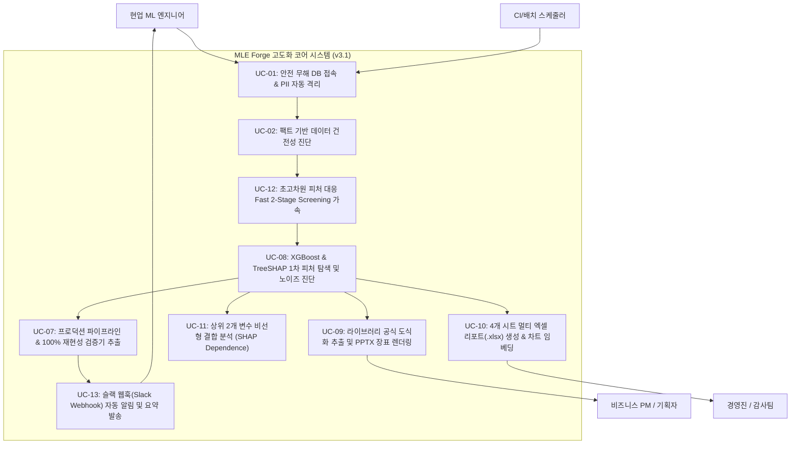

# [개발 산출물] 12. 고도화 유스케이스 및 시나리오 명세서 (Use Case Specification v3.1)

- **문서 번호:** DOC-20260915-SPEC-UC
- **프로젝트명:** Auto Data Analyzer & ML Scout (`MLE Forge`)
- **작성 주체:** 5인 특급 스쿼드 (Lead PO & Server/MLOps Lead)
- **문서 버전:** v3.1 (XGBoost/SHAP 1차 피처 탐색, 공식 도식화 장표, 멀티 시트 엑셀, Dependence 분석, 초고차원 가속, 슬랙 알림 반영)
- **적용 일자:** 2026-09-15 (KST)

---

## 1. 액터(Actor) 정의

| 액터 | 구분 | 역할 및 주요 목표 | 시스템과의 주 접점 |
|:---|:---:|:---|:---|
| **현업 ML 엔지니어** | Primary | 반복적인 EDA, 피처 분석, 보고서 작성을 5분 만에 끝내고 프로덕션 배포 파이프라인 획득 | CLI (`main.py`), Streamlit Web UI, 코드 산출물 |
| **비즈니스 PM / 기획자** | Secondary | 모델의 1차 피처 중요도와 방향성(+/-), 피처 엔지니어링 논리를 직관적으로 이해하고 기획에 반영 | 필수 5장 PPTX 장표, 웹 대시보드 |
| **경영진 / 감사팀** | Stakeholder | 데이터 건전성, 모델 도입 타당성 증빙 및 감사 증적 자료를 신속하게 확인 | 4개 시트 엑셀 리포트(.xlsx), HTML 종합 리포트 |
| **운영 DB / 배치 스케줄러** | External | 원천 데이터를 안전하게 제공하고, 새벽 배치 완료 후 슬랙 알림을 수신 | Read-Only 커넥터, Slack Incoming Webhook |

---

## 2. 유스케이스 다이어그램 (Use Case Diagram)

---

## 3. 핵심 유스케이스 상세 명세

### [UC-08] XGBoost & TreeSHAP 1차 피처 탐색 및 노이즈 진단
* **주 액터:** 현업 ML 엔지니어
* **트리거:** 전처리 파이프라인 학습 데이터셋 분할 완료 시 자동 트리거
* **사전 조건(Pre-conditions):**
  * 타겟 컬럼(`target_col`)이 지정되어 있고 결측치가 정제된 학습 데이터프레임 존재.
* **기본 흐름(Main Flow):**
  1. 시스템은 `XGBoostFeatureScout`를 초기화하고 분류/회귀 문제 유형에 맞추어 XGBoost 모델을 초고속 학습한다.
  2. K-Fold 교차 검증 또는 홀드아웃 검증을 통해 XGBoost 단일 모델의 베이스라인 점수(ROC-AUC / F1 / R2)를 산출한다.
  3. `shap.TreeExplainer`를 가동하여 표본 데이터에 대한 엄밀한 SHAP 값을 계산한다 (TreeSHAP 불가 환경 시 FastMarginal Fallback).
  4. 각 변수별 평균 절대 SHAP 기여율(%)과 변수 값과 SHAP 값 간의 상관계수를 연산하여 **영향 방향성(Positive / Negative / Non-Linear)**을 자동 판별한다.
  5. 기여율 1.5% 미만인 변수를 **노이즈 의심 후보(Noise Candidates)**로 분류하고 제외(Drop) 권고를 생성한다.
  6. 상위 연속형 변수 간의 **비율 합성(Ratio)** 및 왜도가 1.2를 초과하는 변수의 **Log1p 변환** 처방전을 자동 도출한다.
* **사후 조건(Post-conditions):**
  * `xgboost_shap_analysis` 결과 딕셔너리가 SSOT 감사 로그에 저장되고 후속 모듈에 전달된다.
* **예외 흐름(Exception Flow):**
  * **E1 (타겟 불균형 극단치/단일 클래스):** 경고 로그를 출력하고 비상 대조군 점수로 대체 후 안전하게 탐색을 지속한다.

---

### [UC-09] 라이브러리 공식 도식화 추출 및 PPTX 장표 렌더링
* **주 액터:** 현업 ML 엔지니어, 비즈니스 PM
* **트리거:** 감사 로그 생성 후 프레젠테이션 렌더링 단계
* **사전 조건(Pre-conditions):**
  * `XGBoostFeatureScout` 연산이 완료되어 `last_shap_values_` 및 `last_model_`이 메모리에 보존되어 있음.
* **기본 흐름(Main Flow):**
  1. `export_native_plots()`가 호출되어 다음 공식 도식화 이미지를 고해상도(150 DPI) PNG로 저장한다:
     - `shap_beeswarm.png`: `shap.summary_plot` 기반 점 분포 및 Red/Blue 영향도.
     - `xgb_importance.png`: `xgboost.plot_importance` 기반 Gain 지표 중요도.
     - `shap_bar.png`: 글로벌 정량 중요도 막대그래프.
  2. `PptxDeckBuilder`가 16:9 와이드스크린 슬라이드를 생성한다.
  3. **Slide 2**: 좌측에 공식 SHAP Beeswarm 플롯을 전면 배치하고, 우측 상단에 공식 XGBoost Importance 플롯, 우측 하단에 비즈니스 해석 카드를 조립한다.
  4. 슬라이드 하단에 피처 분석 총평 및 후속 엔지니어링 전략 액션 바를 삽입한다.
* **사후 조건(Post-conditions):**
  * 파워포인트 파일(`{table}_presentation_deck.pptx`)이 `dist/`에 산출된다.

---

### [UC-10] 4개 시트 멀티 엑셀 리포트(.xlsx) 생성 & 차트 임베딩
* **주 액터:** 경영진, 금융/규제 감사팀, ML 엔지니어
* **트리거:** 산출물 렌더링 단계 (`ExcelReportBuilder.build_report`)
* **사전 조건(Pre-conditions):**
  * `audit_data` 내에 `xgboost_shap_analysis`, `data_health`, `ml_scout` 정보가 완비되어 있음.
* **기본 흐름(Main Flow):**
  1. `openpyxl` 워크북을 생성하고 4개 핵심 시트를 초기화한다:
     - **Sheet 1 (`1차_피처분석_SHAP`)**: 피처 순위, 기여율, SHAP값, 방향성, 상관계수, 비즈니스 일상어 해석, 노이즈 판정 표 작성.
     - **Sheet 2 (`피처합성_추천`)**: 파생 비율(Ratio) 및 왜도 보정(Log1p) 수식/사유 표 작성.
     - **Sheet 3 (`데이터_건전성_진단`)**: 결측치, 수치형 변수 통계, 다중공선성 매트릭스 작성.
     - **Sheet 4 (`AutoML_리더보드`)**: 모델 순위, 평가 지표, 학습 시간 작성.
  2. Sheet 1의 `J4` 셀 위치에 **공식 SHAP Beeswarm 플롯 이미지**를 임베딩한다.
  3. Sheet 1의 `J22` 셀 위치에 **공식 XGBoost Importance 플롯 이미지**를 임베딩한다.
  4. 전체 시트의 열 너비(Auto-fit Column Width)를 자동 계산하여 한글과 숫자가 잘리지 않도록 정렬한다.
  5. 통합 엑셀 파일(`{table}_analysis_report.xlsx`)로 저장한다.
* **사후 조건(Post-conditions):**
  * 엑셀 파일이 즉시 열람 및 이메일/보고 첨부 가능한 상태로 저장된다.

---

### [UC-11] 상위 2개 변수 비선형 결합 분석 (SHAP Dependence)
* **주 액터:** 핀테크/금융 규제 담당 MLE, 고도화 분석가
* **기본 흐름(Main Flow):**
  1. 1차 탐색 결과 가장 기여율이 높은 1위 피처와 2위 피처를 선정한다.
  2. `shap.dependence_plot` 또는 `shap.plots.scatter`를 실행하여 1위 피처 값을 X축, SHAP 값을 Y축, 2위 피처 값을 컬러바(Hue)로 매핑한 도식화(`shap_dependence_top2.png`)를 생성한다.
  3. 두 변수 간의 비선형 교차 영향(Interaction Effect)을 도출한다.
  4. 엑셀 Sheet 2(`피처합성_추천`) 우측 영역에 해당 이미지를 자동 임베딩하여 비율 합성 추천의 시각적 근거를 제공한다.
  5. PPTX 장표 확장 옵션 가동 시 Slide 6(부록)에 전면 배치한다.

---

### [UC-12] 초고차원 피처 대응 Fast 2-Stage Screening 가속
* **주 액터:** 대규모 이커머스/광고 로그 MLE
* **트리거:** 피처 수가 임계치(예: 50개 이상)를 초과하거나 CLI 플래그 `--shap-max-features K` 지정 시
* **기본 흐름(Main Flow):**
  1. XGBoost 모델을 얕은 깊이(depth=3, n_estimators=50)로 가볍게 피팅한다.
  2. 원천 가중치(Weight/Gain)를 기준으로 상위 K개(기본 30개)의 핵심 피처를 1차 고속 필터링한다.
  3. 선별된 상위 K개 피처셋에 대해서만 정밀 TreeSHAP 계산 및 Beeswarm 플롯을 생성한다.
  4. 피처 수가 수백 개에 달하더라도 전체 연산 시간을 10초 이내로 유지한다.

---

### [UC-13] 슬랙 웹훅(Slack Webhook) 자동 알림 및 요약 발송
* **주 액터:** 1인 MLOps 엔지니어, CI/CD 배치 파이프라인
* **트리거:** 파이프라인 최종 산출물 생성 완료 시 (`main.py` 종료 직전)
* **사전 조건(Pre-conditions):**
  * `--slack-webhook-url` 인자 또는 환경변수 `SLACK_WEBHOOK_URL` 등록
* **기본 흐름(Main Flow):**
  1. 시스템은 `SlackNotifier`를 호출하여 분석 완료 메시지 블록(Block Kit)을 구성한다.
  2. 메시지에는 DB/테이블명, 데이터 건전성 점수, 베스트 모델 점수, 1위 지배 피처, 생성된 파일 경로 요약이 포함된다.
  3. 비동기 HTTP POST로 슬랙 채널에 카드 메시지를 전송하고 성공 여부를 감사 로그에 남긴다.
