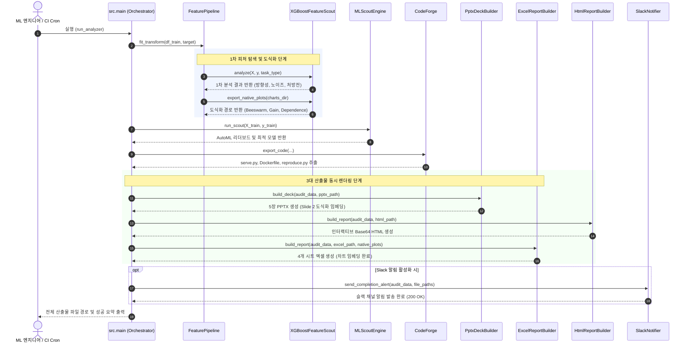

# [개발 산출물] 13. 고도화 인터페이스 정의서 및 시퀀스 다이어그램 (Interface Specification & Sequence Diagrams v3.1)

- **문서 번호:** DOC-20260915-SPEC-INT
- **프로젝트명:** Auto Data Analyzer & ML Scout (`MLE Forge`)
- **작성 주체:** 5인 특급 스쿼드 (Server/MLOps Lead & Frontend Lead)
- **문서 버전:** v3.1
- **적용 일자:** 2026-09-15 (KST)

---

## 1. 핵심 모듈 클래스 및 메서드 인터페이스

### 1.1 `XGBoostFeatureScout` (`src/pipeline/xgboost_feature_scout.py`)
초기 EDA 및 피처 엔지니어링을 자동화하는 고속 탐색 엔진입니다.

```python
class XGBoostFeatureScout:
    def __init__(
        self,
        n_estimators: int = 100,
        max_depth: int = 4,
        learning_rate: float = 0.08,
        random_seed: int = 42,
        noise_threshold_pct: float = 1.5,
        max_background_samples: int = 300,
        fast_screening_threshold: int = 50
    ): ...

    def analyze(
        self,
        X: pd.DataFrame,
        y: pd.Series,
        task_type: str = "Binary_Classification",
        max_features: Optional[int] = None
    ) -> Dict[str, Any]:
        """
        XGBoost 초고속 피팅, TreeSHAP 값 산출, 피처별 기여율/방향성/상관관계 분석,
        노이즈 변수 식별 및 합성 추천 처방전을 도출합니다.
        """
        ...

    def export_native_plots(self, output_dir: str) -> Dict[str, str]:
        """
        라이브러리 공식 도식화 이미지를 고해상도(150 DPI) PNG 파일로 추출합니다.
        반환값: {
            "shap_beeswarm": "/path/to/shap_beeswarm.png",
            "shap_bar": "/path/to/shap_bar.png",
            "xgb_importance": "/path/to/xgb_importance.png"
        }
        """
        ...

    def export_dependence_plot(
        self,
        output_dir: str,
        feature_x: Optional[str] = None,
        feature_color: Optional[str] = None
    ) -> str:
        """
        상위 1위(feature_x)와 2위(feature_color) 변수 간의 비선형 결합 영향을 나타내는
        공식 SHAP Dependence/Scatter 도식화를 생성합니다.
        반환값: "/path/to/shap_dependence_top2.png"
        """
        ...
```

---

### 1.2 `ExcelReportBuilder` (`src/presenter/excel_builder.py`)
4개 핵심 시트와 고해상도 차트 이미지가 임베딩된 엑셀 보고서를 생성합니다.

```python
class ExcelReportBuilder:
    def __init__(self): ...

    def build_report(
        self,
        audit_data: Dict[str, Any],
        output_xlsx_path: str,
        chart_image_path: Optional[str] = None,
        native_plots: Optional[Dict[str, str]] = None
    ) -> str:
        """
        다음 4개 시트로 구성된 .xlsx 파일을 렌더링하고 차트 이미지를 임베딩합니다:
        - Sheet 1: 1차_피처분석_SHAP (표 + J4 SHAP Beeswarm + J22 XGBoost Importance)
        - Sheet 2: 피처합성_추천 (비율/Log1p 표 + 우측 SHAP Dependence 상호작용 차트)
        - Sheet 3: 데이터_건전성_진단 (결측치, 수치형 변수 상태, 다중공선성)
        - Sheet 4: AutoML_리더보드 (모델별 벤치마크 및 검증 점수)
        """
        ...
```

---

### 1.3 `SlackNotifier` (`src/serving/slack_notifier.py`)
분석 파이프라인 완료 시 핵심 요약과 산출물 경로를 슬랙 웹훅으로 전송합니다.

```python
class SlackNotifier:
    def __init__(self, webhook_url: Optional[str] = None):
        self.webhook_url = webhook_url or os.getenv("SLACK_WEBHOOK_URL")

    def send_completion_alert(
        self,
        audit_data: Dict[str, Any],
        artifacts: Dict[str, str]
    ) -> bool:
        """
        분석 완료 Block Kit 카드를 구성하여 슬랙 채널로 전송합니다.
        포함 항목: DB 테이블명, 건전성 점수, XGBoost 베이스라인, 1위 모델, PPTX/엑셀 생성 경로
        """
        ...
```

---

## 2. CLI 커맨드라인 인터페이스 명세 (`src/main.py`)

```bash
uv run python src/main.py [OPTIONS]
```

### 2.1 CLI 파라미터 정의 테이블

| 옵션명 | 축약형 | 타입 | 기본값 | 필수 | 설명 |
|:---|:---:|:---:|:---:|:---:|:---|
| `--db-url` | `-d` | str | - | **Yes** | SQLAlchemy 지원 데이터베이스 접속 URL 또는 CSV 파일 경로 |
| `--table` | `-t` | str | None | No | 대상 테이블명 (지정 안 할 경우 첫 번째 테이블 자동 선택) |
| `--target` | `-y` | str | None | No | 지도학습 예측 대상 타겟 컬럼명 |
| `--out-dir` | `-o` | str | `dist` | No | 모든 산출물(PPTX, XLSX, HTML, 서빙 패키지)이 저장될 디렉터리 |
| `--sample-size` | `-s` | int | 50000 | No | OOM 방지 적응형 샘플링 임계치 |
| `--shap-max-features` | - | int | 30 | No | 초고차원 피처 대응 Fast Screening 임계 피처 수 |
| `--enable-dependence` | - | bool | True | No | 상위 2개 변수 SHAP Dependence 도식화 생성 여부 |
| `--slack-webhook-url` | - | str | None | No | 분석 완료 시 알림을 수신할 Slack Incoming Webhook URL |

---

## 3. REST API 서빙 인터페이스 명세 (`serve.py`)

FastAPI 기반의 경량 실시간 추론 및 XAI 설명 API 인터페이스입니다.

### 3.1 `POST /predict` (실시간 배치/단건 예측)
* **Request Body (JSON):**
```json
{
  "features": [
    {
      "contract": "Month-to-month",
      "tenure": 12,
      "monthly_charges": 65.5,
      "total_charges": 786.0
    }
  ]
}
```
* **Response Body (JSON):**
```json
{
  "predictions": [1],
  "probabilities": [0.784],
  "latency_ms": 3.2,
  "model_version": "v2.1.0-HistGradientBoosting"
}
```

### 3.2 `POST /explain_shap` (실시간 단건 SHAP 기여도 분해)
* **Response Body (JSON):**
```json
{
  "base_value": 0.265,
  "prediction": 0.784,
  "top_positive_contributors": [
    {"feature": "contract_Month-to-month", "shap_value": 0.312},
    {"feature": "monthly_charges", "shap_value": 0.145}
  ],
  "top_negative_contributors": [
    {"feature": "tenure", "shap_value": -0.098}
  ]
}
```

---

## 4. 데이터 구조 명세 (SSOT 감사 로그 `run_audit.json`)

`xgboost_shap_analysis` 객체 스키마 정의:

```json
{
  "xgboost_shap_analysis": {
    "engine": "XGBoost + TreeSHAP",
    "baseline_metric": "ROC-AUC",
    "baseline_score": 0.6874,
    "top_features": [
      {
        "rank": 1,
        "feature": "contract_One year",
        "impact_pct": 28.5,
        "mean_abs_shap": 0.4521,
        "direction": "Positive (+)",
        "correlation": 0.612,
        "interpretation": "변수 증가 시 타겟 위험/예측치 상승"
      }
    ],
    "noise_candidates": [
      {
        "feature": "customer_id",
        "impact_pct": 0.12,
        "recommendation": "기여도 미미 (<1.5%), 서빙 경량화 및 과적합 방지를 위해 제외 권고"
      }
    ],
    "recommendations": {
      "recommended_ratios": [
        {
          "suggested_name": "monthly_charges_per_tenure",
          "formula": "monthly_charges / (tenure + 1e-6)",
          "rationale": "최상위 영향 변수 간의 상대적 비율을 통해 비선형 시너지 포착"
        }
      ],
      "recommended_log_transforms": [
        {
          "suggested_name": "total_charges_log1p",
          "skewness": 2.15,
          "formula": "np.log1p(total_charges)",
          "rationale": "우측 왜도(2.15)가 심한 변수로, log1p 변환 시 정규분포화로 모델 분별력 개선"
        }
      ]
    },
    "native_plots": {
      "shap_beeswarm": "dist/charts/shap_beeswarm.png",
      "shap_bar": "dist/charts/shap_bar.png",
      "xgb_importance": "dist/charts/xgb_importance.png",
      "shap_dependence": "dist/charts/shap_dependence_top2.png"
    }
  }
}
```

---

## 5. 엔드투엔드 시퀀스 다이어그램 (E2E Sequence Diagram)


