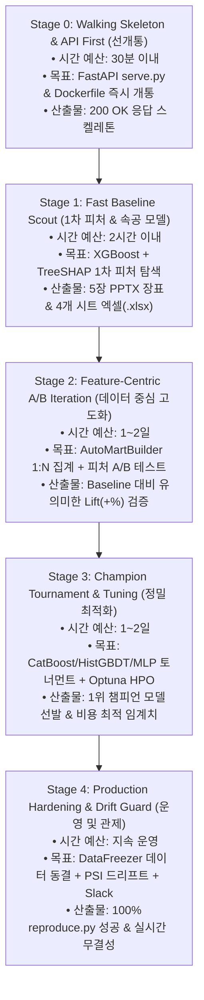

# [개발방법론 & 실무가이드] 16. 실무형 API 선개통 후고도화 ML 개발 방법론 플레이북
- **문서 번호:** DOC-20260915-METH-01
- **프로젝트명:** Auto Data Analyzer & ML Scout (`MLE Forge`)
- **작성 주체:** 5인 특급 스쿼드 (Lead PO & Server/MLOps Lead)
- **대상 독자:** 초보·주니어 ML 엔지니어, 애자일 데이터팀 리드, 실무 AI 프로덕트 매니저
- **문서 버전:** v1.0 (High-Velocity Evolutionary ML Framework)
- **적용 일자:** 2026-09-15 (KST)

---

## 1. 🛑 현업의 냉혹한 현실: 학술 이론 vs 실무 현장

### 1.1 교과서적 방법론(CRISP-DM)이 실무에서 무너지는 이유
데이터 과학 교과서나 학술 강의에서는 흔히 다음과 같은 이상적인 순서를 가르칩니다:
> *"문제 정의 $\rightarrow$ 심층 데이터 분석(EDA) $\rightarrow$ 완벽한 결측치/이상치 정제 $\rightarrow$ 피처 엔지니어링 $\rightarrow$ 모델 학습 $\rightarrow$ 평가 $\rightarrow$ 최종 배포"*

하지만 **실제 기업 현업(스타트업, 테크 플랫폼, 금융사, 커머스)의 현실은 완전히 다릅니다:**
1. **타 팀의 블로킹(Blocking):** 백엔드 개발팀과 프론트엔드 팀은 "모델 성능이 95%냐 90%냐"보다 **"우리가 붙일 수 있는 API 스펙(URL, Request JSON, Response JSON)이 언제 나오느냐"**가 당장 급합니다. 모델을 정밀하게 만드느라 2~3주를 보내면 타 팀 전체의 스프린트가 멈춥니다.
2. **이해관계자의 피드백 지연:** 기획자나 경영진은 수백 줄의 EDA 주피터 노트북을 보지 않습니다. 동작하는 화면이나 엑셀/장표를 직접 보기 전까지는 요구사항이 구체화되지 않습니다.
3. **배포 지옥(Deployment Hell):** 주피터 노트북에서 AUC 0.98을 찍어놓고 마지막 주에 가서야 서빙 컨테이너를 만드려다 라이브러리 충돌, 메모리 초과, 재현 실패로 릴리즈가 펑크 납니다.

### 1.2 초보 ML 엔지니어가 빠지는 가장 위험한 5대 함정 (Anti-Patterns)

| 순번 | 치명적 안티패턴 | 초보 엔지니어의 착각 | 현업에서의 실제 비참한 결과 |
|:---:|:---|:---|:---|
| **1** | **전처리 완벽주의 함정** | "데이터를 100% 완벽하게 분석하고 정제한 뒤 모델링에 들어가야지." | 2주 동안 EDA만 하다가 정작 모델은 구경도 못 하고 일정 압박에 쫓김 |
| **2** | **복잡한 딥러닝 맹신 함정** | "최신 트랜스포머나 딥러닝을 써야 실력 있는 엔지니어처럼 보이겠지." | 정형 데이터에서 GBDT보다 성능도 안 나오고 학습 시간과 GPU 비용만 낭비 |
| **3** | **배포 파이프라인 후순위 함정** | "모델 성능부터 99%로 올리고, API 배포는 맨 마지막에 해야지." | 로컬 환경에선 잘 돌던 코드가 도커 컨테이너나 운영 서버에서 의존성 충돌로 폭망 |
| **4** | **설명력(XAI) 부재 함정** | "점수만 높으면 사업부나 경영진이 알아서 인정해 주겠지." | "이 모델을 왜 믿어야 하죠? 왜 이 고객을 이탈로 예측했죠?" 질문에 한마디도 못함 |
| **5** | **데이터 재현성 방치 함정** | "내 노트북에서 돌아갔으니 결과 캡처해서 슬랙에 공유해야지." | 한 달 뒤 "그때 그 모델 다시 돌려봐" 했을 때 데이터가 바뀌어 비트 단위 재현 불가 |

---

## 2. 💡 핵심 철학: "API 선개통 후고도화 (Tracer Bullet ML)"

우리가 제안하는 방법론의 본질은 **"선(先)개통 후(後)고도화 (Pipeline-First, Evolutionary ML)"**입니다.

```
┌─────────────────────────────────────────────────────────────────────────────────┐
│                      전통적 순차 개발 vs API 선개통 후고도화                     │
├─────────────────────────────────────────────────────────────────────────────────┤
│ [전통 방식]  EDA (2주) ──> 전처리 (1주) ──> 모델링 (1주) ──> 배포 시도 (폭망!)   │
│                                                                                 │
│ [선개통 방식]                                                                   │
│  • Day 1 (0.5시간): Walking Skeleton API 선개통 (타 팀 블로킹 즉시 해소)        │
│  • Day 1 (2.0시간): Fast Baseline Scout (XGBoost/SHAP + 엑셀/PPTX 1차 보고)      │
│  • Day 2~3        : Feature-Centric A/B Iteration (마트 집계 & 합성 리프트 검증) │
│  • Day 4~5        : Champion Tournament & HPO (정밀 튜닝 & 비용 최적 임계치)    │
│  • Day 6+         : Production Hardening (데이터 동결 & PSI 관제 & 슬랙 알림)    │
└─────────────────────────────────────────────────────────────────────────────────┘
```

* **보행 스켈레톤 (The Walking Skeleton):** 
  비록 알맹이는 단순한 룰이나 베이스라인일지라도, DB 접속부터 전처리, 추론, FastAPI 응답, 도커 컨테이너까지 이어지는 **가장 얇은 엔드투엔드(End-to-End) 파이프라인을 30분 만에 먼저 뚫어놓는 것**입니다.
* **추적탄 (Tracer Bullet):** 
  어둠 속에서 표적을 맞추기 위해 처음부터 완벽한 조준을 계산하는 대신, 빛을 내뿜으며 날아가는 추적탄을 먼저 쏘아 탄착군(전체 파이프라인 궤적)을 확인하고 오차를 수정해 나갑니다.

---

## 3. 🚀 5단계 고속 실무 라이프사이클 (Stage 0 ~ Stage 4)



### [Stage 0] Walking Skeleton & API First (선개통) — 30분 이내
* **초보 엔지니어 미션:** 백엔드/클라이언트 팀에 줄 API 명세를 단 30분 만에 넘겨주기.
* **실행 절차:**
  1. `SafeDBConnector`로 원천 데이터 5,000건 안전 로드 (PII 자동 격리).
  2. 모델 성능에 신경 쓰지 않고 단일 결정 트리나 단순 최빈값으로 `CodeForge` 가동.
  3. `export_pipeline/serve.py` 실행 $\rightarrow$ `curl http://localhost:8000/predict`로 `{"prediction": 1}` 응답 확인.
* **달성 효과:** 백엔드 팀이 모델 완성될 때까지 기다리지 않고 프론트 연동 및 통합 테스트에 즉시 착수함.

---

### [Stage 1] Fast Baseline Scout (1차 피처 & 속공 모델) — 2시간 이내
* **초보 엔지니어 미션:** 당일 오후 경영진/기획자 회의에 들고 갈 1차 근거 자료 확보.
* **실행 절차:**
  1. `XGBoostFeatureScout` 가동 $\rightarrow$ XGBoost 단일 베이스라인 점수(ROC-AUC) 획득.
  2. TreeSHAP을 통해 1위 지배 변수와 노이즈 의심 변수(기여율 < 1.5%)를 식별.
  3. **공식 SHAP Beeswarm 플롯 & XGBoost Gain 중요도 차트** 자동 추출.
  4. 산출된 **5장 PPTX 장표**와 **4개 시트 엑셀(.xlsx)**을 미팅 자료로 송부.
* **달성 효과:** "아, 우리 데이터에서는 계약 기간과 월 납부액이 핵심이구나! 불필요한 성별/ID 컬럼은 빼자"는 비즈니스 조기 정렬 완료.

---

### [Stage 2] Feature-Centric A/B Iteration (데이터 중심 고도화) — 1~2일
* **초보 엔지니어 미션:** 복잡한 알고리즘을 바꾸기 전에, "피처 품질"로 모델 성능 리프트 끌어올리기.
* **실행 절차:**
  1. `AutoMartBuilder`를 가동하여 연관 트랜잭션 테이블(`orders`)의 1:N 집계 피처(`order_count`, `amount_sum` 등)를 자동 합성.
  2. Stage 1 처방전에서 제안된 비율(Ratio) 및 Log1p 왜도 보정 적용.
  3. `FeatureABTester`로 동일한 5-Fold 교차 검증 환경에서 Baseline(Group A) 대비 실험군(Group B)의 성능 리프트(+%) 측정.
* **달성 효과:** 알고리즘 튜닝 없이 오직 피처 엔지니어링만으로 +5~15% 성능 향상 달성.

---

### [Stage 3] Champion Tournament & Tuning (정밀 최적화) — 1~2일
* **초보 엔지니어 미션:** 최고의 알고리즘을 선발하고 실제 비즈니스 손실(Cost)을 최소화하기.
* **실행 절차:**
  1. `MLScoutEngine`으로 CatBoost, LightGBM, HistGBDT, TabularDeepNet(MLP), Random Forest 간 토너먼트 가동.
  2. 상위 1~2개 후보 모델에 대해 Optuna Bayesian HPO(타임아웃 3분) 적용.
  3. `CostThresholdTuner`로 기본 0.5 확률 컷오프 대신, 오탐(False Positive)과 미탐(False Negative)의 비즈니스 비용이 최소가 되는 **최적 결정 임계치(Optimal Threshold, 예: 0.38)** 도출.
* **달성 효과:** 과적합 없이 운영 환경에서 가장 튼튼하고 비즈니스 수익을 극대화하는 챔피언 모델 확정.

---

### [Stage 4] Production Hardening & Drift Guard (운영 및 관제) — 지속 운영
* **초보 엔지니어 미션:** 배포 후 장애 방지, 감사 증적 확보 및 자동화 관제.
* **실행 절차:**
  1. `DataFreezer` 스냅샷 및 `data_manifest.json` 생성.
  2. 터미널에서 `python reproduce.py`를 실행하여 100% 비트 단위 모델 재현성 검증.
  3. `DriftMonitor` 링 버퍼를 통해 실시간 수신 데이터의 PSI(Population Stability Index) 감시.
  4. `SlackNotifier`를 연동하여 배치 종료 및 드리프트 이상 발생 시 슬랙 채널로 긴급 알림 전송.
* **달성 효과:** "한 달 뒤 모델이 왜 이상해졌는지", "과거 학습 데이터가 무엇이었는지"에 대한 완벽한 감사 추적성 확보.

---

## 4. 🧭 상황별 실무 내비게이션 (4대 긴급 시나리오 스케치)

초보 ML 엔지니어가 회사에서 맞닥뜨리는 4가지 전형적인 위기 상황별 처방전입니다.

```
┌─────────────────────────────────────────────────────────────────────────────┐
│                 상황별 원클릭 실행 커맨드 가이드 (Fast Navigation)           │
├─────────────────────────────────────────────────────────────────────────────┤
│ 1. [긴급 데모] 내일 아침 임원 보고용 장표/엑셀이 당장 필요할 때:             │
│    $ uv run python src/main.py -d sqlite:///db.sqlite -t customers -y churn │
│    -> 2분 만에 PPTX 5장 장표, 엑셀 4개 시트, HTML 대시보드 자동 산출!        │
│                                                                             │
│ 2. [협업 독촉] 백엔드 개발팀이 API 스펙과 도커 컨테이너를 달라고 보챌 때:  │
│    $ cd dist/export_pipeline && docker build -t my-ml-serve .               │
│    -> FastAPI 실시간 서빙 API와 Swagger Docs(http://localhost:8000/docs) 즉시 제공│
│                                                                             │
│ 3. [성능 정체] 베이스라인은 나왔는데 점수를 2~3% 더 올려야 할 때:           │
│    $ uv run python src/main.py ... --auto-mart --enable-dependence          │
│    -> 연관 테이블 마트 자동 집계 + 2개 변수 결합 비선형 상호작용 피처 발굴!  │
│                                                                             │
│ 4. [배치/감사] 금융 규제 감사 및 새벽 크론 배치 자동화가 필요할 때:        │
│    $ uv run python src/main.py ... --slack-webhook-url https://hooks.slack..│
│    -> 데이터 동결 해시 검증 + 슬랙 채널로 결과 요약 자동 전송!             │
└─────────────────────────────────────────────────────────────────────────────┘
```

---

## 5. 🛠️ CLI 통합 내비게이터 모듈 (`MethodologyNavigator`)

우리 프로젝트의 코어 엔진에는 이 방법론을 실시간으로 진단해 주는 **`MethodologyNavigator` (`src/ml_scout/methodology_navigator.py`)**가 내장되어 있습니다.

CLI 실행이 완료되면 터미널에 다음과 같은 비주얼 아스키 로드맵과 초보 엔지니어를 위한 체크리스트가 자동 출력됩니다:

```text
┌─────────────────────────────────────────────────────────────────────────────┐
│          🚀 실무형 API 선개통 후고도화 ML 개발 방법론 로드맵 (Playbook)      │
├─────────────────────────────────────────────────────────────────────────────┤
│  ● [완료] Stage 0: Walking Skeleton & API First (선개통)                    │
│      │  (FastAPI 서빙 스켈레톤 선개통 -> 타 팀 블로킹 해소, 30분)           │
│      ▼                                                                      │
│  ● [완료] Stage 1: Fast Baseline Scout (1차 피처 & 속공 모델)               │
│      │  (XGBoost+TreeSHAP 1차 피처 탐색 -> 엑셀/PPTX 비즈니스 증빙)          │
│      ▼                                                                      │
│  ● [완료] Stage 2: Feature-Centric A/B Iteration (데이터 중심 고도화)       │
│      │  (마트 자동 집계 + 결측치 거버넌스 + 피처 A/B 테스트 Lift 검증)      │
│      ▼                                                                      │
│  ● [완료] Stage 3: Champion Tournament & Tuning (정밀 최적화)               │
│      │  (알고리즘 토너먼트 + HPO 튜닝 + 비즈니스 비용 최적 임계치)           │
│      ▼                                                                      │
│  ▶ [현재] Stage 4: Production Hardening & Drift Guard (운영 및 관제)        │
│         (데이터 동결 100% 재현성 + PSI 드리프트 관제 + 슬랙 알림)            │
└─────────────────────────────────────────────────────────────────────────────┘
```

---

## 6. 🎓 요약 및 초보 엔지니어를 위한 3대 황금률

1. **"완벽한 모델을 기다리게 하지 말고, 동작하는 파이프라인을 먼저 선물하라."**
   - 첫날에 API와 베이스라인을 먼저 열어주면, 타 팀의 협조를 얻으며 훨씬 여유롭게 고도화할 수 있습니다.
2. **"알고리즘을 바꾸기 전에 피처와 데이터를 먼저 의심하라."**
   - 하이퍼파라미터 10시간 돌리는 것보다, 연관 마트 테이블에서 좋은 비율 피처 하나를 합성하는 것이 성능을 10배 더 올립니다.
3. **"설명하지 못하는 모델과 재현되지 않는 결과는 실무에서 쓰레기다."**
   - SHAP 도식화와 데이터 동결 매니페스트는 여러분의 모델을 사내에 안착시키는 가장 강력한 무기입니다.
