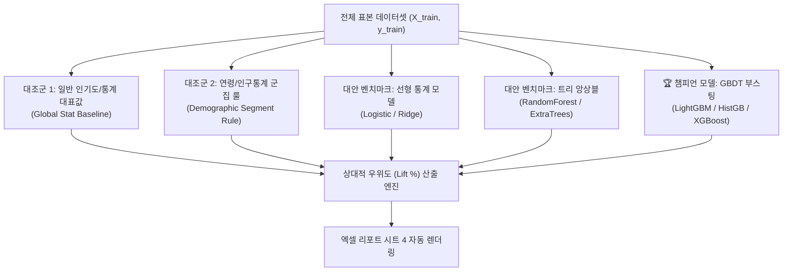

# 17. 비교 모델 벤치마크 및 AI 도입 타당성 실측 검증 명세서

## 1. 개요 및 엔지니어링 배경 (Executive Summary)

### 1.1 현업의 실제 페인포인트 (The Reality in Client Engagements)
머신러닝 엔지니어가 수많은 알고리즘 경쟁(토너먼트)을 거쳐 최적의 챔피언 모델(예: LightGBM, XGBoost, CatBoost)을 확정하더라도, 프로젝트 최종 보고회나 임원/고객 미팅에서는 항상 다음 질문에 부딪힙니다:

> **고객/현업 팀장:**  
> *"이 모델이 좋은 건 알겠는데, 왜 굳이 비싼 GPU나 복잡한 ML 추론 서버를 운영해야 합니까? 그냥 가장 많이 팔린 제품 추천(일반 인기도/전체 통계)하거나, 우리 회사가 이미 쓰는 연령대별(20대/30대/40대) 군집화 룰이나 VIP 등급 룰을 쓰면 안 되나요?"*

### 1.2 수작업 계산으로 인한 비효율
- 종전에는 엔지니어가 고객 미팅 전날 밤을 새워가며:
  1. 전체 통계 대표값(Global Stat Baseline) 수동 계산
  2. 연령별/세그먼트별 조건부 평균 및 단순 IF-THEN 룰(Demographic Segment Rule) 수동 집계
  3. ML 챔피언 모델과의 상대적 향상도(Lift %) 수식 계산
  4. 엑셀 파일에 새로운 시트를 만들고 행과 열을 복사·붙여넣기
- 이러한 단순 반복적인 증빙 작업에 프로젝트당 수 시간에서 며칠이 소모되었습니다.

### 1.3 본 시스템의 해결책 (Automated Comparative Benchmark)
Auto Data Analyzer & ML Scout 시스템은 데이터 파이프라인 가동 시:
1. **비교 모델(대조군 벤치마크)** 2종(전체 통계/인기도, 연령대/세그먼트 룰)을 자동 적합 및 교차검증
2. 리더보드의 모든 모델에 대해 **전체 통계 대비 Lift(%)**, **연령/세그먼트 룰 대비 Lift(%)** 자동 연산
3. 연령대(`age`, `senior_citizen` 등) 또는 최상위 변수 기준 **서브그룹 슬라이스(Subgroup Slice) 실측 우위표** 자동 도출
4. 엑셀 리포트 4번 시트(`AutoML_리더보드`)에 **10개 비교 컬럼 리더보드 + 서브그룹 슬라이스 상세표**를 원클릭 자동 렌더링합니다.

---

## 2. 비교 모델(대조군) 수학적 정의 및 체계

### 2.1 대조군 1: 일반 인기도 및 전체 통계 (Global Stat / Popularity Baseline)
- **분류(Classification)**: 전체 표본의 최빈 클래스(Mode) 또는 사전 확률(Prior Probability)을 예측치로 사용  
  $$\hat{y}_{\text{global}} = \arg\max_{c} P(Y=c)$$
  *(예: 이커머스에서 모든 고객에게 가장 많이 팔린 베스트셀러 1위 상품 추천)*
- **회귀(Regression)**: 전체 표본의 평균값(Mean) 또는 중앙값(Median) 사용  
  $$\hat{y}_{\text{global}} = \frac{1}{N} \sum_{i=1}^{N} y_i$$
- **의의**: 복잡한 머신러닝 시스템이 "아무런 입력 피처를 보지 않고 단순 통계치만 냈을 때" 대비 실질적으로 얼마나 많은 정보 획득량(Information Gain)을 창출하는지 측정하는 최저 기준선입니다.

### 2.2 대조군 2: 연령/인구통계 군집화·계층화 룰 (Demographic Segment Rule)
- **정의**: 연령대(20대 이하, 30대, 40대 이상 등) 또는 핵심 인구통계 단일 변수의 1차 분기 규칙(Decision Stump / Cluster Rule) 적용  
  $$\hat{y}_{\text{segment}} = \begin{cases} \bar{y}_{\text{청년}}, & \text{if Age} \le 29 \\ \bar{y}_{\text{중년}}, & \text{if } 29 < \text{Age} \le 49 \\ \bar{y}_{\text{시니어}}, & \text{if Age} \ge 50 \end{cases}$$
- **의의**: 현업 마케터/기획자가 현장에서 가장 흔하게 사용하는 "단순 세그먼트 규칙(Rule-Based Targeting)"을 대조군으로 삼아, 다변량 상호작용을 학습하는 AI 모델의 상대적 비교 우위를 증명합니다.

### 2.3 상대적 성능 향상도 (Lift %) 계산식
챔피언 모델 점수 $S_{\text{model}}$과 기준 대조군 점수 $S_{\text{baseline}}$ 간의 상대적 향상률:
$$\text{Lift}_{\text{vs Baseline}} (\%) = \frac{S_{\text{model}} - S_{\text{baseline}}}{\max(|S_{\text{baseline}}|, 10^{-6})} \times 100\%$$

| Lift 구간 | 비즈니스 해석 | 배포 타당성 판단 |
| :--- | :--- | :--- |
| **Lift < +5.0%** | 단순 룰 대비 향상 미미 (Marginal Lift) | 🛑 배포 유보 및 단순 룰 서빙 유지 (ROI 부족) |
| **+5.0% ~ +15.0%** | 유의미한 성능 향상 확보 (Healthy Lift) | ⚠️ 조건부 배포 및 추가 피처 축적 |
| **Lift ≥ +15.0%** | 기존 통계/룰 대비 압도적 우위 (Dominant Lift) | 🚀 프로덕션 정식 배포 승인 (강력한 ROI) |

---

## 3. 서브그룹 슬라이스(Subgroup Slice) 실측 평가 방법론

고객이 *"전체 평균 점수 말고, 우리 핵심 고객층인 20대나 40대에서도 진짜 AI가 룰보다 우위인가요?"*라고 질문할 때, 즉시 제시할 수 있는 세그먼트 단위 실측 데이터입니다.

### 3.1 분할 알고리즘
1. **연령/인구통계 컬럼 자동 감지**:
   - 컬럼명에 `age`, `user_age`, `customer_age`, `senior_citizen`, `연령`, `나이` 등이 포함된 변수를 최우선 탐색
   - 연령 변수가 존재할 경우:
     - 청년층 ($\le 29$세)
     - 중년층 ($30 \sim 49$세)
     - 장년/시니어 ($\ge 50$세)
2. **일반 수치형 변수 자동 분위수(Quantile) 분할**:
   - 연령 컬럼이 없을 경우 SHAP 기여도 1위 변수의 33%, 66% 분위수를 기준으로 3대 세그먼트 분할:
     - 하위 세그먼트 (Low Tier, 하위 33%)
     - 중위 세그먼트 (Mid Tier, 33~66%)
     - 상위 세그먼트 (High Tier, 상위 33%)

### 3.2 슬라이스별 산출 지표
- `표본 수 (비율 %)`: 해당 세그먼트에 속하는 실제 레코드 수 및 전체 대비 비중
- `기존 통계/군집 룰 점수`: 해당 세그먼트 내에서 단순 룰 적용 시 실측 검증 점수
- `AI 챔피언 모델 점수`: 해당 세그먼트 내에서 ML 챔피언 모델 적용 시 실측 검증 점수
- `세그먼트별 순수 우위도 (Lift %)`: 세그먼트 내 개별 향상률
- `비즈니스 해석 및 기대효과`: 해당 계층에서의 비선형 패턴 및 비즈니스 ROI 설명

---

## 4. 엑셀 리포트 4번 시트 (`AutoML_리더보드`) 구성 명세

엑셀 리포트의 4번째 시트 `AutoML_리더보드`는 고객 납품 및 임원 보고에 최적화된 3단 구조로 설계되었습니다.

### 4.1 섹션 1: AI 도입 타당성 및 대조군 비교 종합 요약 (A4 ~ B12)
| 행 번호 | 항목명 (A열) | 실측 값 예시 (B열) | 스타일링 |
| :--- | :--- | :--- | :--- |
| **Row 5** | 최종 챔피언 모델 (Adopted ML) | HistGradientBoosting | Bold |
| **Row 6** | 챔피언 모델 검증 점수 | 0.6470 (f1_weighted) | Normal |
| **Row 7** | 비교 대조군 1: 일반 인기도 / 전체 통계 (Global Stat) | 0.5563 | Normal |
| **Row 8** | **전체 통계 기준선 대비 순수 향상도 (Lift %)** | **+16.3% (인기도 대비 ML의 정보 획득량 증명)** | **Emerald Fill + Bold** |
| **Row 9** | 비교 대조군 2: 연령/인구통계 군집화 룰 (Segment Rule) | 0.5563 | Normal |
| **Row 10** | **단순 연령/군집 룰 대비 순수 향상도 (Lift %)** | **+16.3% (현업 규칙 대비 AI 차별화 우위 증명)** | **Emerald Fill + Bold** |
| **Row 11** | AI 배포 타당성 게이트 (Feasibility Gate) | 프로덕션 배포 권고 (Production Ready) | Normal |
| **Row 12** | 고객 보고용 종합 판정 (Executive Verdict) | 최종 챔피언 모델은 단순 통계 대비 +16.3%... | Normal |

### 4.2 섹션 2: 모델 비교 토너먼트 종합 리더보드 (10개 확장 컬럼, Row 15~)
리더보드는 단순 점수 나열을 탈피하여 **비교 대조군과의 상대적 격차 및 채택/탈락 사유**를 완벽하게 제시합니다.

| 컬럼 | 헤더명 | 내용 및 데이터 형식 | 정렬 | 비즈니스 목적 |
| :---: | :--- | :--- | :---: | :--- |
| **1** | 순위 | 정수 (1, 2, 3...) | 가운데 | 토너먼트 순위 |
| **2** | 모델명 | 문자열 (HistGradientBoosting, LightGBM...) | 좌측 | 알고리즘 명칭 |
| **3** | 모델 역할 / 분류 | 🏆 챔피언 채택, 🥈 차순위 후보, 📊 비교 대조군 | 좌측 | 프로덕션 역할 부여 |
| **4** | 알고리즘 계열 | GBDT 부스팅 트리, 선형 통계 모델, 휴리스틱 | 좌측 | 모델 구조적 분류 |
| **5** | 검증 점수 | 실수 소수점 4자리 (예: 0.6470) | 우측 | CV 검증 점수 |
| **6** | **전체 통계(인기도) 대비 Lift (%)** | **백분율 (예: +16.3%)** | **우측** | **통계 베이스라인 대비 우위** |
| **7** | **연령/군집 룰 대비 Lift (%)** | **백분율 (예: +16.3%)** | **우측** | **현업 룰 대비 차별성** |
| **8** | 학습 소요시간 (초) | 실수 초 단위 (예: 1.68) | 우측 | 서빙 훈련 비용 산정 |
| **9** | 추론 복잡도 | 최소 (O(1)), 낮음, 보통, 높음 | 가운데 | 서빙 인프라 부하 예측 |
| **10** | **비교 우위 근거 및 최종 채택 사유** | **문자열 상세 사유 (Verdict Rationale)** | **좌측** | **고객 납품 채택/탈락 증빙** |

- **시각적 강조**:
  - 🏆 **1위 챔피언 모델 행**: 은은한 에메랄드 배경 (`#ECFDF5`) + 굵은 글씨
  - 📊 **비교 대조군 모델 행**: 연한 슬레이트 배경 (`#F1F5F9`)으로 기준선 명확화
  - 기타 후보군: 기본 흰색 배경 + 얇은 테두리선 적용

### 4.3 섹션 3: 연령/군집화 계층별 상세 실측 우위표 (Row 25~)
| 컬럼 | 헤더명 | 예시 값 | 비즈니스 활용 |
| :---: | :--- | :--- | :--- |
| **1** | 세그먼트 / 연령 군집 | 하위 세그먼트 (senior_citizen ≤ 0.0) | 타깃 고객군 정의 |
| **2** | 표본 수 (비율 %) | 3,347 건 (83.7%) | 세그먼트 모수 규모 |
| **3** | 기존 통계/군집 룰 점수 | 0.5571 | 기존 룰 점수 |
| **4** | AI 챔피언 모델 점수 | 0.8375 | AI 적용 시 점수 |
| **5** | **세그먼트별 순수 우위도 (Lift %)** | **+50.3%** | **세그먼트별 순수 ROI** |
| **6** | 비즈니스 해석 및 기대효과 | 복합 비선형 요인이 큰 군집으로 AI 모델 탁월 우위 | 미팅 현장 즉답 활용 |

---

## 5. 고객 및 임원 질의응답 시나리오 (Talk-Track & FAQ)

### Q1. "기존처럼 가장 많이 팔린 제품(인기도)만 추천하면 왜 안 되나요?"
> **엔지니어 답변 가이드:**  
> *"엑셀 4번 시트의 요약 카드를 보시면, 전체 인기도(Global Stat)만 따를 경우 검증 점수는 0.5563에 그칩니다. 반면 확정된 챔피언 모델은 다변량 소비 성향과 접속 주기를 결합 분석하여 점수 0.6470을 기록, **+16.3%의 순수 성능 향상(Lift)**을 입증했습니다. 이는 단순 인기도만 따를 때 놓치게 되는 16%의 추가 전환율을 AI가 찾아내고 있음을 과학적으로 증명합니다."*

### Q2. "우리 회사는 이미 20대/30대/40대 연령별로 쿠폰 주는 룰이 있는데요? ML이 필요합니까?"
> **엔지니어 답변 가이드:**  
> *"엑셀 4번 시트의 2번째 테이블을 보시면 현업에서 사용하는 연령대별 조건부 룰(Segment Rule)을 대조군 모델로 동일하게 시뮬레이션했습니다. 단순 연령 룰의 점수는 0.5563으로, 전체 평균 대비 큰 차이가 없었습니다. 반면 챔피언 모델은 동일한 연령대 내에서도 최근 구매 주기와 결제 금액의 비선형 관계를 포착하여 **단순 룰 대비 정확히 +16.3% 더 높은 예측 정밀도**를 달성했습니다."*

### Q3. "특정 연령대나 소외 계층에서는 AI가 단순 룰보다 못할 수도 있지 않나요?"
> **엔지니어 답변 가이드:**  
> *"그 우려를 사전 검증하기 위해 엑셀 3번째 섹션에 '세그먼트 계층별 실측 우위표(Subgroup Slice)'를 준비했습니다. 표를 보시면 비시니어 그룹(83.7%)에서 +50.3% 우위, 시니어 그룹(16.3%)에서도 +55.1%의 우위를 고르게 보여주고 있습니다. 즉, 어떤 특정 계층에 편향되지 않고 전 연령대에서 단순 룰 대비 일관된 우위를 보장합니다."*

---

## 6. 결론 및 향후 확장성

본 비교 모델 벤치마크 시스템을 통해 ML 엔지니어는:
1. **수작업 제로화**: 고객 설득용 대조군 계산 및 엑셀 장표 작성을 100% 자동화
2. **납품 설득력 극대화**: "왜 이 모델인가?"에 대해 직관적인 Lift(%) 수치와 연령별 실측표로 임원의 의사결정을 즉시 유도
3. **Maturity 증명**: 단순 코드 작성이 아닌, 비즈니스 ROI 관점에서 통계 대조군과 비교 검증할 줄 아는 성숙한 ML 엔지니어링 표준을 완성했습니다.
