# 18. 범용 이식성 및 멀티 환경 구동 아키텍처 명세서 (Universal Portability Architecture)

## 1. 개요 및 설계 철학 (Executive Summary)

### 1.1 "어느 환경에서도 바로 붙여서 사용한다"의 의미
머신러닝 엔지니어링 실무에서 가장 큰 병목은 모델링 자체가 아니라 **"고객사 및 인프라마다 완전히 제각각인 환경 차이"**에서 발생합니다:
- 어떤 고객사는 AWS/GCP 클라우드 상의 **PostgreSQL/MySQL**을 사용합니다.
- 어떤 고객사는 금융/공공 기관의 **온프레미스 망분리 폐쇄망(Air-Gapped Intranet)** 환경에서 **Oracle/MS-SQL**을 사용하며 외부 인터넷이 100% 차단되어 있습니다.
- 어떤 고객사는 보안 규정상 DB 접속 권한을 주지 않고 **2GB 규모의 Parquet, CSV, Excel 파일 덤프**만 제공합니다.
- 데이터 과학자는 **Jupyter Notebook, Google Colab, Databricks** 안에서 즉시 코드로 실행하고 싶어 합니다.
- MLOps 엔지니어는 **Airflow, Kubeflow, CI/CD, Docker/Kubernetes** 안에서 헤드리스 CLI로 실행하고 싶어 합니다.
- 비개발자 기획자/임원은 브라우저에서 버튼 하나로 동작하는 **대화형 Web UI**를 선호합니다.

본 시스템은 **"단일 엔진으로 데이터 형태, 런타임, OS, 리소스 스펙, 네트워크 격리 여부와 무관하게 즉시 작동하는 범용 이식성(Universal Portability)"**을 제품의 핵심 가치로 확립하였습니다.

---

## 2. 5대 범용 이식성 아키텍처 (5 Pillars of Universal Portability)

```mermaid
graph TD
    subgraph "Pillar 1: Any Data Source (데이터 다양성)"
        D1["SQL RDBMS (Oracle, PG, MySQL, SQLite, MSSQL)"]
        D2["레이크하우스 & 파일 (Parquet, Excel, CSV, JSONL)"]
        D3["In-Memory Pandas DataFrame (Jupyter SDK)"]
    end

    subgraph "Pillar 2: Any Runtime Mode (5대 실행 방식)"
        R1["1) 헤드리스 CLI (Bash / PowerShell / Airflow)"]
        R2["2) Python SDK (Jupyter Notebook / Colab)"]
        R3["3) 대화형 Web UI (Streamlit 브라우저)"]
        R4["4) Cloud-Native Container (Docker / K8s)"]
        R5["5) REST API 마이크로서비스 (FastAPI)"]
    end

    subgraph "Pillar 3: Any OS & Platform (크로스 플랫폼)"
        O1["Windows 10/11 (PowerShell, CMD)"]
        O2["Linux (Ubuntu, Debian, CentOS, Rocky, RHEL)"]
        O3["macOS (Apple Silicon M1/M2/M3 & Intel x86_64)"]
        O4["한글 폰트 동적 폴백 (나눔고딕, 본고딕, 맑은고딕)"]
        O5["다중 인코딩 복원력 (UTF-8, CP949, EUC-KR)"]
    end

    subgraph "Pillar 4: Any Resource Spec (저사양부터 고사양까지)"
        S1["1-Core 2GB RAM 소형 VM (OOM 방지 메모리 가드)"]
        S2["대용량 적응형 비편향 샘플링 (Adaptive Sampling)"]
        S3["멀티코어 / GPU 가속 부스팅 (XGBoost, LightGBM)"]
    end

    subgraph "Pillar 5: Air-Gapped & Zero-Lockin (폐쇄망 무의존성)"
        A1["외부 인터넷 통신 제로 (100% 오프라인 동작)"]
        A2["MS 오피스 미설치 서버 완벽 호환 (PPTX, XLSX)"]
        A3["독립형 오프라인 단일 HTML 대시보드 (Base64 인라인)"]
        A4["표준 파이썬 재현성 스크립트 (reproduce.py)"]
    end

    D1 & D2 & D3 --> ENGINE["MLE Forge 코어 엔진"]
    R1 & R2 & R3 & R4 & R5 --> ENGINE
    O1 & O2 & O3 & O4 & O5 --> ENGINE
    S1 & S2 & S3 --> ENGINE
    A1 & A2 & A3 & A4 --> ENGINE
```



---

## 3. 세부 영역별 이식성 구현 기술

### 3.1 Pillar 1: Any Data Source (데이터 무결성 및 자동 탐지)
- **SafeDBConnector 다중 포맷 자동 파싱**:
  - `sqlite:///...`, `postgresql://...`, `mysql://...`, `oracle://...`, `mssql://...`
  - `.parquet`, `parquet://...`: 빅데이터 레이크하우스 표준 지원 (pyarrow 초고속 파싱)
  - `.xlsx`, `.xls`, `excel://...`: 시트 목록 자동 탐색 및 특정 시트 로드 (`openpyxl`)
  - `.csv`, `csv://...`: `utf-8` &rarr; `cp949` &rarr; `euc-kr` &rarr; `latin1` 4단계 자동 인코딩 폴백
  - `.json`, `.jsonl`: 단일 JSON 객체 및 스트리밍 JSON Lines 완벽 지원
- **In-Memory DataFrame 직결**:
  - 파일 저장이 필요 없는 메모리 상의 `pd.DataFrame`을 직접 수용하여 파이프라인 가동

### 3.2 Pillar 2: Any Runtime Modality (5대 인터페이스)

| 실행 모드 | 사용 명령어 / 코드 예시 | 주 활용 대상 및 장점 |
| :--- | :--- | :--- |
| **1) CLI 모드** | `python -m src.main --file data.parquet --target churn` | CI/CD, Airflow DAG, 크론잡, 리눅스 베스천 서버 |
| **2) Python SDK 모드** | `from src.sdk import AutoDataAnalyzer`<br/>`analyzer.analyze_dataframe(df, target_col="churn")` | Jupyter Notebook, Google Colab, Databricks 연구원 |
| **3) 대화형 Web UI** | `streamlit run web.py` 또는 `python web.py` | 비개발자 기획자, 비즈니스 분석가 브라우저 인터랙션 |
| **4) Docker 컨테이너** | `docker run -v $(pwd)/dist:/app/dist ...` | 쿠버네티스(K8s), AWS ECS, 온프레미스 컨테이너 환경 |
| **5) REST API 서빙** | `uvicorn src.serving.serve:app --port 8000` | 사내 마이크로서비스 실시간 추론 연동 |

### 3.3 Pillar 3: Any OS & Platform (크로스 플랫폼 한글/폰트 안전성)
- **운영체제 경로 분리 독립성**:
  - Windows의 역슬래시(`\`)와 Linux/macOS의 슬래시(`/`)를 `os.path.normpath` 및 `pathlib`으로 완전 정규화
- **크로스 플랫폼 CJK 한글 폰트 동적 폴백**:
  - 서버에 특정 OS 폰트(예: 맑은 고딕)가 없더라도 Tofu(글자 깨짐 네모 박스) 현상이 발생하지 않도록 7대 폰트 우선순위 탐색:
    ```python
    plt.rcParams["font.sans-serif"] = [
        "NanumGothic", "Noto Sans CJK KR", "AppleGothic", 
        "Malgun Gothic", "DejaVu Sans", "Arial", "sans-serif"
    ]
    plt.rcParams["axes.unicode_minus"] = False
    ```

### 3.4 Pillar 4: Any Resource Spec (저사양 VM OOM 가드)
- **적응형 비편향 샘플링 (Adaptive Unbiased Sampling)**:
  - 표본 수가 50,000건을 초과할 경우, DB 수준에서 Native Bernoulli/Uniform Random 추출을 적용하여 1-Core 2GB RAM 저사양 장비에서도 메모리 고갈 방지
- **컬럼 메모리 가드 (Column-Level Memory Guard)**:
  - 메모리 사용량이 `max_memory_mb`(기본 500MB)를 초과할 경우 거대 텍스트/객체 컬럼을 상위 200자로 안전하게 슬라이싱하여 OOM 사전에 차단

### 3.5 Pillar 5: Air-Gapped 폐쇄망 & Zero-Lockin (완전 독립성)
- **외부 통신 제로 (No Internet Required)**:
  - 허깅페이스, 외부 CDN, 원격 클라우드 API 호출이 전혀 없는 순수 로컬 인메모리 연산
- **오피스 프로그램 미설치 서버 구동**:
  - 리눅스 서버나 Docker 컨테이너에 Microsoft PowerPoint나 Excel이 설치되어 있지 않아도 `python-pptx`와 `openpyxl` 순수 파이썬 라이브러리로 완성도 높은 비주얼 `.pptx` 및 `.xlsx` 바이너리 직접 빌드
- **오프라인 단일 HTML 대시보드**:
  - 차트 및 스타일을 모두 Base64 Data URI 및 인라인 CSS로 번들링하여 오프라인 브라우저에서 완벽 렌더링

---

## 4. 환경별 실전 레시피 (Quickstart Recipes)

### Recipe 1: 주피터 노트북 / Colab / Databricks (단 3줄 구동)
```python
import pandas as pd
from src.sdk import AutoDataAnalyzer

# 1. 데이터 로드
df = pd.read_csv("my_dataset.csv")

# 2. SDK 초기화 및 원클릭 분석 실행
analyzer = AutoDataAnalyzer(output_dir="./report_dist")
audit_result = analyzer.analyze_dataframe(df, target_col="churn", dataset_name="customer_churn")

# 3. 결과 확인
print("최종 승자 모델:", audit_result["ml_scout"]["best_model"])
print("통계 대비 Lift:", audit_result["ml_scout"]["lift_analysis"]["lift_vs_global_pct"], "%")
# ./report_dist/ 폴더에 PPTX, XLSX, HTML, REST API 서버 패키지가 생성됩니다.
```

### Recipe 2: 온프레미스 망분리 폐쇄망 (Linux CLI)
```bash
# 1. 휠(Wheel) 또는 오프라인 venv 환경에서 즉시 실행
python -m src.main \
  --file /data/lakehouse/customer_events.parquet \
  --target churn \
  --out-dir /reports/2026_q3
```

### Recipe 3: Docker 컨테이너 원라이너
```bash
# 도커 컨테이너로 볼륨 마운트하여 실행
docker run --rm \
  -v $(pwd)/data:/app/data \
  -v $(pwd)/dist:/app/dist \
  auto-data-analyzer \
  --file /app/data/sample.parquet \
  --target churn
```

### Recipe 4: Apache Airflow DAG 태스크 연동
```python
from airflow.operators.bash import BashOperator

ml_scout_task = BashOperator(
    task_id="auto_ml_scout_and_report",
    bash_command=(
        "python -m src.main "
        "--db-url postgresql://user:pwd@db:5432/warehouse "
        "--table daily_sales "
        "--target revenue "
        "--out-dir /shared/dist/{{ ds }}"
    ),
    dag=dag
)
```

---

## 5. 결론 및 기대효과

1. **온보딩 마찰 제로 (Zero Setup Friction)**:
   - 어떤 고객사 인프라에 투입되더라도 "이 환경에서는 안 됩니다"라는 거절 없이 즉시 파이프라인 가동
2. **개발 시간 단축**:
   - 데이터 추출, 탐색적 데이터 분석(EDA), 피처 엔지니어링, 알고리즘 토너먼트, 대조군 비교 엑셀 작성, 배포 패키지 생성까지 수일이 걸리던 작업을 **10분 내 자동 완결**
3. **엔터프라이즈 신뢰성**:
   - 읽기 전용 보장, OOM 방지, 망분리 지원, 크로스 플랫폼 한글 무결성을 통해 가장 보수적인 공공/금융 기업에서도 안전하게 채택 가능한 표준 솔루션을 확립했습니다.
