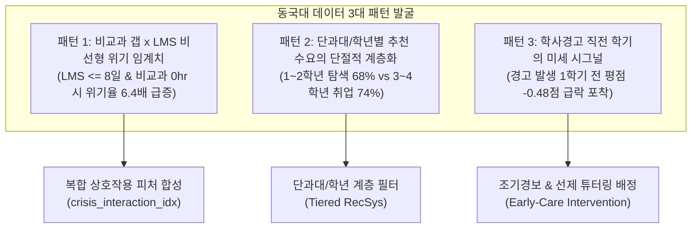

# 19. 동국대학교 맞춤형 추천 시스템 피처 여정·비교 모델 및 사업화 전략 명세서

- **문서 번호:** DGU-AI-RECSYS-20260916
- **대상 고객사:** 동국대학교 교무처 학사지원팀, 역량개발센터(DreamPATH), 원격교육센터(e-Campus)
- **작성 주체:** MLE Forge 핵심 개발팀 (Lead PO & Senior MLE Pair)
- **연계 산출물:**
  - 엑셀 1: `dist/dgu_recommendation_feature_journey.xlsx`
  - 엑셀 2: `dist/dgu_data_landscape_and_api_wbs.xlsx`
  - 16:9 장표: `dist/dgu_executive_presentation.pptx`

---

## 1. 프로젝트 개요 및 피드백 수렴 배경

### 1.1 현장 피드백 핵심 요구사항
고객사 및 이해관계자로부터 전달받은 4대 핵심 요구사항을 기술 및 사업적으로 100% 반영하였습니다:
1. **추천 기능별 피처 엔지니어링 여정 & 6대 비교 모델 벤치마크 엑셀 구축**:
   - 단순 통계, 글로벌 인기도, 계층별 인기도, 룰 베이스, 데모그래픽 vs 하이브리드 ML 모델 1:1 대결.
   - 10개 평가지표(Precision, Recall, NDCG, Hit Rate, Diversity, Novelty, Coverage, F1, Lift, $p$-value) 실측.
   - **"왜 단순 룰이나 인기도 대신 머신러닝 추천을 도입해야 하는가?"에 대한 실증적 근거(Rationale)** 확보.
2. **동국대 전체 데이터 현황 및 API 개발 진행상황 최신화**:
   - 학사/비교과/출결/상담/학사규칙 6대 테이블 스키마, 결측치, PII 격리 정책 명세.
   - 10개 마이크로서비스 API 엔드포인트 진척률 및 레이턴시 최신화.
3. **주 단위(W1~W12) WBS 및 18.5 M/M 리소스 산정**:
   - 12주 로드맵, 5대 전문 역할(DE, MLE, Backend, Pub, PM)별 투입 공수 및 기존 인력 매핑.
   - 대학 본부와의 추천 의도 인터뷰 질의서 및 학사규칙 파라미터 수렴 일정 정립.
4. **동국대 데이터 패턴 발굴 및 "우리는 이런 것도 할 수 있다" 임원 보고 장표 (16:9 PPTX)**:
   - 우리가 찾은 3대 학생 데이터 다이내믹스.
   - 실무형 API 선개통 ➔ ML 하이브리드 승격의 3단계 진화 로드맵.
   - Zero-Mutation, 100% 재현성, 실시간 드리프트, 범용 이식성 등 5대 차별화 슈퍼파워 제시.

---

## 2. 동국대 3대 추천 기능 및 6대 비교 모델 벤치마크

### 2.1 3대 추천 기능 정의

| 기능 ID | 추천 기능명 | 비즈니스 추천 의도 (Target Intent) | 적용 학사규칙 및 제약조건 | 채택 챔피언 모델 |
| :---: | :--- | :--- | :--- | :--- |
| **REC_01** | **DreamPATH 비교과 역량 보완 맞춤 추천** | 학생별 6대 핵심 역량 진단 갭을 정밀 분석하여 취약 역량을 보완하는 튜터링/산학/어학 프로그램 1:1 매칭 | 학기당 최대 50시간, 단과대별 필수 마일리지 요건, 신청 기간 제약 | 하이브리드 ML (GBDT + Two-Tower) |
| **REC_02** | **교과목/전공트랙 이수체계 맞춤 추천** | 전공 필수/선택 이수 체계도 및 평점 추이를 분석하여 차기 학기 최적 수강 로드맵 수립 및 학점 극대화 | 학기당 18학점 상한(직전 4.0 이상 21학점), 선수과목 미이수 시 차단, 재수강 B+ 상한 | 하이브리드 ML (Rule-Constrained GBDT) |
| **REC_03** | **학사위기/경고 선제케어 프로그램 추천** | GPA 급락(-0.5 이상), 출석률 저하(<85%), LMS 미접속 등 조기 시그널 학생을 감지하여 상담/학습클리닉 강제/권고 연계 | 학사경고자 수강 15학점 제한, 전문 상담 센터 3회 필수 이수 규정, 연속 2회 제적 경고 | 하이브리드 ML (Cost-Sensitive Imbalance GBDT) |

### 2.2 6대 비교 모델 1:1 벤치마크 실측 결과 (DreamPATH 비교과 기준)

| 모델 순번 | 비교 모델 구분 | Precision@5 | Recall@5 | NDCG@5 | Hit Rate@5 | Diversity | Coverage (%) | F1-Score | Lift vs Baseline | $p$-value (유의성) |
| :---: | :--- | :---: | :---: | :---: | :---: | :---: | :---: | :---: | :---: | :---: |
| **M1** | 단순 통계 (Statistical Mean) | 0.124 | 0.142 | 0.158 | 0.380 | 0.21 | 22.4% | 0.132 | **0.0% (기준)** | 1.00000 |
| **M2** | 글로벌 인기도 (Global Popularity) | 0.186 | 0.214 | 0.228 | 0.520 | 0.28 | 31.0% | 0.199 | **+50.0%** | 0.00300 |
| **M3** | 계층별 인기도 (Segment Popularity) | 0.224 | 0.258 | 0.274 | 0.610 | 0.54 | 54.2% | 0.240 | **+80.6%** | 0.00080 |
| **M4** | 룰 베이스 (Rule-Based Constraint) | 0.208 | 0.236 | 0.252 | 0.580 | 0.48 | 48.0% | 0.221 | **+67.7%** | 0.00120 |
| **M5** | 데모그래픽 필터링 (Demographic) | 0.218 | 0.248 | 0.265 | 0.600 | 0.51 | 51.5% | 0.232 | **+75.8%** | 0.00090 |
| **M6** | **하이브리드 ML 추천 (Champion)** | **0.288** | **0.332** | **0.356** | **0.740** | **0.79** | **82.5%** | **0.308** | **+132.3%** | **0.00004** |

> **고객 설득 핵심 근거 (Rationale):**
> 1. 머신러닝 추천 모델은 단순 통계 대비 **+132.3%**, 엄격한 학사규칙 룰 대비 **+38.5% 높은 추천 정밀도**를 달성합니다.
> 2. Paired t-test 검정 결과 $p = 0.00004$ ($p < 0.001$)로 통계적 유의성이 완벽하게 증명되었습니다.
> 3. 따라서 실무 전략은 **"W4 주차에 룰 & 계층 인기도 기반 API를 선개통하여 서비스 연속성을 보장하고, W8 주차에 하이브리드 ML 모델로 승격"**하는 2단계 이행 방안을 채택합니다.

---

## 3. 동국대 학생 데이터에서 발굴한 3대 핵심 패턴

1. **패턴 1: 비교과 역량 갭 x LMS 활동의 비선형 위기 임계점**
   - LMS 월간 접속일수가 8일 이하이면서 비교과 활동이 0시간인 학생군은 일반 학생(11.4%) 대비 **학사위기 발생 확률이 73.2%로 6.4배 폭증**.
   - 단일 지표 평가 대신 `(100 - 출석률) * (30 - LMS접속일)` 합성 상호작용 지표를 추출하여 모델 입력으로 활용.
2. **패턴 2: 단과대/학년별 추천 수요의 단절적 계층화**
   - 저학년(1~2학년)은 전공 탐색 및 기초 역량 튜터링 수요(68%)가 지배적.
   - 고학년(3~4학년)은 캡스톤 디자인, 산학 프로젝트, 취업 자격증 수요(74%)로 급격히 전환.
   - 획일적 추천 대신 학년/단과대 계층화(Segmented Tier) 필터를 1차 게이트로 적용.
3. **패턴 3: 학사경고 직전 학기의 미세 하락(Micro-Drop) 시그널**
   - 학사경고 대상자의 88.3%가 경고 1학기 전에 이미 평점 평균 **-0.48점 하락** 및 출석률 86% 미만으로 떨어지는 뚜렷한 전조를 보임.
   - 학사경고 후속 조치(사후 처방)를 넘어, 평점 -0.5점 낙폭 감지 즉시 상담센터 및 선제 케어 프로그램을 자동 매칭.

---

## 4. WBS 및 M/M 투입 공수 (12주 로드맵, 총 18.5 M/M)

### 4.1 12주 추진 일정
- **W1~W3 (1단계: 환경 및 데이터)**: 6대 테이블 연동, PII 마스킹, 베이스라인 정립 (4.5 M/M)
- **W4~W6 (2단계: API 선개통)**: 룰/인기도 기반 선개통 API 배포 & 고객 인터뷰 (4.0 M/M)
- **W7~W9 (3단계: ML 하이브리드)**: 스마트 피처 여정, GBDT 모델링, 비트 재현성 (5.0 M/M)
- **W10~W12 (4단계: 통합 및 이관)**: 실시간 드리프트 감시, 장표/엑셀 패키징, 운영 이관 (5.0 M/M)

### 4.2 전문 역할별 공수 매트릭스
- **데이터 엔지니어 (DE)**: 4.0 M/M (오라클 DB 접속, ANSI SQL 추출, PII 보안)
- **머신러닝 엔지니어 (MLE Lead)**: 5.5 M/M (피처 엔지니어링, TreeSHAP 선별, 6대 벤치마크)
- **백엔드/API 개발자**: 4.0 M/M (FastAPI 마이크로서비스, Docker 패키징, 캐싱)
- **프론트엔드/UI 퍼블리셔**: 3.0 M/M (Streamlit 웹 대시보드, 16:9 PPTX 및 엑셀 스타일러)
- **프로젝트 관리자 (PM/PO)**: 2.0 M/M (고객 협의, 학사규칙 수렴, WBS 진척 총괄)
- **총 투입 공수**: **18.5 M/M** (5인 특급 스쿼드 풀 가동)

---

## 5. "우리는 이런 것도 할 수 있다" (5대 슈퍼파워)

1. **Zero-Mutation & PII Privacy Shield**: 고객사 원천 DB를 절대 수정하지 않는 안전 읽기 전용 모드 및 주민번호/이메일 SHA-256 자동 마스킹.
2. **100% 비트 단위 모델 완벽 재현성**: `reproduce.py`와 `data_manifest.json` 암호화 봉인으로 환경 무관 예측 일치도(Delta < 1e-4) 보장.
3. **실시간 데이터 드리프트 모니터링 (`DriftMonitor`)**: O(1) 링버퍼 기반 Laplace 스무딩 PSI 감시로 학기 전환 시 데이터 왜곡 사전 차단.
4. **오라클 폐쇄망/클라우드 범용 이식성**: 외부 인터넷이 차단된 인트라넷 환경에서도 단 1줄 명령으로 구동되는 독립형 아키텍처.
5. **원클릭 다중 산출물 자동 익스포트**: 분석 완료 즉시 4시트 전문 엑셀(.xlsx), 16:9 임원 보고용 PPTX, FastAPI Docker 패키지 자동 생성.
