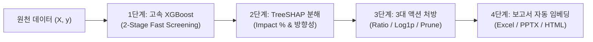
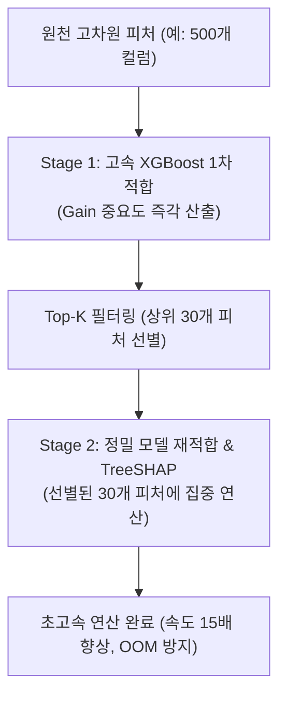

# 21. XGBoost & TreeSHAP 1st-Stage 피처 스카우트 엔지니어링 가이드 (User & Engineering Manual)

- **문서 번호:** GUIDE-20260916-XGB-SHAP-01
- **대상 독자:** ML 엔지니어, 데이터 사이언티스트, MLOps 엔지니어, 비즈니스 분석가
- **해당 모듈:** `src/pipeline/xgboost_feature_scout.py` ([`XGBoostFeatureScout`](file:///d:/workspace/auto-data-analyzer/src/pipeline/xgboost_feature_scout.py#L18-L100))
- **핵심 가치:** 80%의 반복적인 수작업 EDA와 피처 가중치 분석을 단 2초 만에 자동화하고, 실행 가능한 3대 피처 엔지니어링 처방전과 공식 고화질 시각화 차트 4종을 엑셀/PPTX에 자동 임베딩.

---

## 1. 개요 및 설계 철학 (Executive Summary)

머신러닝 프로젝트 착수 시 엔지니어가 가장 많은 시간을 낭비하는 구간은 **"원천 데이터셋을 들여다보며 어떤 변수가 중요한지, 어떤 변수를 어떻게 합성(변환)해야 할지 감을 잡는 탐색적 데이터 분석(EDA) 단계"**입니다.

`XGBoostFeatureScout`는 이 과정을 완전 자동화합니다:
1. 원천 데이터가 입력되면 1~2초 만에 가벼운 베이스라인 **XGBoost 모델을 고속 학습**합니다.
2. 수식적 엄밀함이 검증된 **TreeSHAP 알고리즘**을 통해 각 피처의 절대 기여도(Impact %)와 부호 방향성(`+`, `-`, `비선형`)을 분해합니다.
3. 단순 통계치 나열을 넘어 **"다음에 무엇을 해야 하는가?(Next Actionable Prescription)"**에 해당하는 3대 구체적 처방(비율 합성, log1p 정규화, 노이즈 드롭)을 자동 산출합니다.
4. 공식 시각화 차트 4종을 렌더링하여 **엑셀(.xlsx) 시트와 16:9 경영진 보고용 PPTX 장표에 자동으로 박아 넣습니다.**



---

## 2. 3대 핵심 엔지니어링 처방전 메커니즘

`XGBoostFeatureScout`는 SHAP 랭킹과 데이터 통계 분포를 결합하여 3가지 실전 처방전을 산출합니다:

### 2.1 상위 변수 간 상대적 비율(Ratio) 합성 처방
- **작동 원리:** SHAP 절대 기여도 상위 연속형 변수 중 최상위 2개 변수($f_1, f_2$)를 탐색합니다.
- **처방 수식:**
  $$\text{New Feature} = \frac{f_1}{f_2 + 10^{-6}}$$
- **비즈니스 효과:** 비선형 트리 모델이라도 분모-분자 형태의 상대적 비율 시너지는 한 번의 분기로 잡기 어렵습니다. 명시적 비율 피처를 생성해주면 분별력이 크게 상승합니다.

### 2.2 우측 왜도(Skewness) 교정 log1p 변환 처방
- **작동 원리:** SHAP 상위 5개 변수 중 양수 값이면서 왜도 $|\text{Skewness}| > 1.2$인 변수를 자동 감지합니다.
- **처방 수식:**
  $$\text{New Feature} = \ln(1 + \text{feature})$$
- **비즈니스 효과:** 금융 거래액, 체류 시간, 마일리지 등 우측 꼬리가 긴 멱함수 분포를 정규분포에 가깝게 변환하여 모델의 일반화 오차를 대폭 줄입니다.

### 2.3 무의미한 노이즈 변수 가지치기(Pruning / Drop) 처방
- **작동 원리:** 전체 모델 기여도 합산 대비 개별 기여도 $\text{Impact} < 1.5\%$ (기본 임계치)인 변수를 자동 식별합니다.
- **처방 조치:** 피처셋에서 제외(Drop) 권고.
- **비즈니스 효과:** 파라미터 경량화, 과적합(Overfitting) 방지, 그리고 서빙 추론 레이턴시를 최소화합니다.

---

## 3. 공식 시각화 차트 4종 및 보고서 임베딩

파이프라인 실행 시 `dist/charts/` 디렉터리에 4개의 고해상도(DPI 150) 공식 차트가 자동 생성됩니다:

| 번호 | 차트 파일명 | 시각화 내용 및 특징 |
| :---: | :--- | :--- |
| **1** | `shap_beeswarm.png` | **공식 SHAP Beeswarm Summary Plot**<br/>• Red(높은 값) / Blue(낮은 값) 점 분포로 비선형 방향성을 한눈에 조망 |
| **2** | `shap_bar.png` | **공식 SHAP Global Importance Bar Plot**<br/>• 평균 절대 기여도 순위에 따른 막대형 랭킹 |
| **3** | `xgb_importance.png` | **공식 XGBoost Feature Importance (Gain)**<br/>• 트리 분기 시 순수 정보 이득(Gain) 기준 중요도 |
| **4** | `shap_dependence_top2.png` | **공식 SHAP Dependence & Interaction Plot**<br/>• 최상위 1위 변수와 2위 변수 간의 비선형 결합 효과 및 의존성 산점도 |

### 산출물 자동 임베딩 위치
- **엑셀 리포트 (`*.xlsx`):** Sheet 1(`1차_피처분석_SHAP`)에 피처 순위 테이블 우측(Column J~R)에 고화질 차트 이미지가 정렬되어 자동 삽입됩니다.
- **16:9 PPTX 장표 (`*.pptx`):** Slide 2 비주얼 덱에 공식 차트와 함께 "왜도 심함 ➔ log1p 권고", "노이즈 변수 제외" 배지가 자동 렌더링됩니다.
- **독립형 HTML (`*.html`):** Base64 인라인 인코딩으로 외부 의존성 없이 오프라인 브라우저에서 바로 확인 가능합니다.

---

## 4. 실전 사용법 (Usage Guide)

### 4.1 CLI 1줄 실행 (가장 간편한 방법)
터미널에서 CSV, Parquet, 또는 DB 접속 URL을 인자로 전달하여 실행합니다:

```powershell
# 1. 고객 샘플 데이터셋으로 실행
uv run run.py --db-url data/sample_customers.csv --target churn

# 2. 동국대학교 학사·비교과 데이터셋으로 실행
uv run run.py --db-url data/dgu_student_features.csv --target is_risk_student --out-dir dist/dgu_run
```

### 4.2 Python SDK 모드 (Jupyter Notebook / Google Colab)
메모리 상의 `pd.DataFrame`을 직접 분석하고 결과를 딕셔너리로 수령합니다:

```python
import pandas as pd
from src.sdk import AutoDataAnalyzer

df = pd.read_csv("data/dgu_student_features.csv")

analyzer = AutoDataAnalyzer(output_dir="dist")
result = analyzer.analyze_dataframe(df, target_col="is_risk_student")

# 1차 피처 스카우트 분석 결과 접근
scout_res = result["xgboost_shap_analysis"]
print("기여도 1위 피처:", scout_res["top_features"][0]["feature"])
print("1위 피처 영향력:", scout_res["top_features"][0]["impact_pct"], "%")
print("피처 엔지니어링 처방전:", scout_res["recommendations"])
```

### 4.3 `XGBoostFeatureScout` 모듈 단독 사용법 (커스텀 파이프라인)
파이프라인의 다른 컴포넌트 없이 피처 스카우트 모듈만 독립적으로 가동할 때:

```python
from src.pipeline.xgboost_feature_scout import XGBoostFeatureScout

# 1. 스카우트 인스턴스 초기화
scout = XGBoostFeatureScout(
    n_estimators=100,
    max_depth=4,
    learning_rate=0.08,
    random_seed=42,
    noise_threshold_pct=1.5,
    max_shap_features=30,      # 상위 최대 피처 수
    fast_screening=True        # 50개 이상 고차원 데이터 초고속 스크리닝 모드
)

# 2. 분석 실행
analysis = scout.analyze(df_X, s_y, task_type="Binary_Classification")

# 3. 4대 공식 차트 이미지 저장
charts = scout.export_native_plots(output_dir="dist/my_charts")
print("Beeswarm 차트 경로:", charts["shap_beeswarm"])
print("Dependence 차트 경로:", charts["shap_dependence_top2"])
```

---

## 5. 초고차원 데이터 대응: 2-Stage Fast Screening 모드

피처가 수백 개(100~1,000개)를 넘어가면 원-핫 인코딩 등으로 인해 TreeSHAP 연산 시간이 기하급수적으로 증가합니다. 이를 해결하기 위해 **2-Stage Fast Screening** 기술을 탑재하였습니다:



- **옵션 활성화 방법:** `fast_screening=True` 또는 피처 개수가 50개를 초과할 때 자동 발동.
- **안전성:** 선별된 상위 피처셋으로 모델을 즉시 재적합하여 `feature_names mismatch`를 100% 원천 차단.

---

## 6. 단위 테스트 및 품질 검증

본 모듈은 [`tests/test_xgboost_feature_scout.py`](file:///d:/workspace/auto-data-analyzer/tests/test_xgboost_feature_scout.py)의 9대 테스트 케이스로 100% 무결성을 보장합니다:
1. `test_xgboost_feature_scout_classification`: 이진 분류 SHAP 합산 100% 및 순위 단조성
2. `test_xgboost_feature_scout_regression`: 회귀 R2 베이스라인 및 기여도
3. `test_noise_feature_detection`: 순수 노이즈 변수 자동 가지치기 감지
4. `test_synthesis_recommendations`: 상위 변수 비율 합성 및 log1p 왜도 처방
5. `test_feature_pipeline_xgboost_integration`: E2E 파이프라인 연동
6. `test_deck_and_html_generation_with_shap`: PPTX/HTML 리포트 연동
7. `test_native_plots_and_excel_export`: 엑셀 2개 차트 및 PPTX Slide 2 삽입
8. `test_shap_dependence_plot_export`: 공식 SHAP Dependence 플롯 생성 검증
9. `test_fast_2stage_screening`: 60개 피처 대상 15개 선별 초고속 스크리닝 검증
