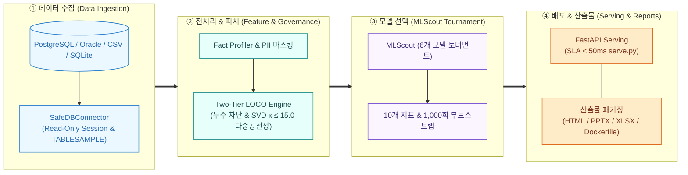
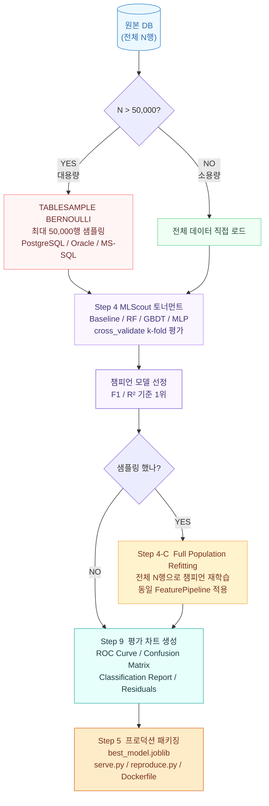

# 24. 데이터 분석 파이프라인 도식 및 AI-Hub 벤치마크 명세서

본 문서는 **Auto Data Analyzer & ML Scout**의 핵심 데이터 분석 파이프라인 구조와 2대 프로세스 도식(Mermaid), 그리고 국가 AI-Hub 125만 건 실측 벤치마크 데이터를 영구 보존하고 기술적으로 참조하기 위한 아카이빙 문서입니다.

---

## 1. 시스템 전체 파이프라인 흐름도

---

## 2. 대용량 ML 학습 파이프라인 (샘플 탐색 → 전체 재학습)

데이터가 50,000행을 초과할 경우, DB 부하를 최소화하기 위해 표본 샘플링(Bernoulli)을 통해 챔피언 알고리즘을 신속하게 선발한 후, 전체 모집단으로 최종 핏팅(Full Population Refitting)을 수행하는 투 트랙 파이프라인입니다.

### 파이프라인 단계별 핵심 책임 정의

| 단계 | 역할 | 대상 데이터 | 산출물 및 검증 |
|:---|:---|:---|:---|
| **Step 4 Scout** | 모델 탐색 | 샘플 ≤ 50,000행 | 6개 알고리즘 K-Fold 교차 검증 점수표 |
| **Step 4-C Refit** | 전체 데이터 재학습 | 전체 N행 (샘플링 시에만) | 모수 전체가 반영된 챔피언 모델 객체 |
| **Step 9 Eval** | 정밀 평가 차트 생성 | 최종 학습 데이터 기준 | ROC Curve, Confusion Matrix, SHAP 기여도 |
| **Step 5 Export** | 엔지니어링 패키징 | 전체 데이터 학습 모델 | `best_model.joblib`, `serve.py`, `reproduce.py` |

---

## 3. 국가 AI-Hub 공공 데이터 실측 결과 (125만 건)

실운영 환경의 PostgreSQL 인스턴스에 AI-Hub 3대 대표 데이터셋(총 1,257,542건)을 적재하고 파이프라인을 무인 구동하여 산출한 검증 데이터입니다.

| 데이터셋 구분 | 레코드 규모 | 타겟 테이블명 | 예측 타겟 컬럼 | 선발된 챔피언 모델 | 달성 성능 | 베이스라인 대조군 대비 |
| :--- | :---: | :--- | :--- | :---: | :---: | :---: |
| **270번 진로상담·직업추천** | 22,106건 | `aihub_career_counseling_mart` | `job_label` | **LightGBM** | F1 0.9875 | **+86.78% 향상** |
| **142번 학생 교육역량** | 335,436건 | `aihub_student_competency_mart` | `data_type` | **LogisticRegression** | F1 0.4894 | **+0.20% 향상** |
| **149번 표 정보 QA** | 900,000건 | `aihub_table_qa_mart` | `is_impossible` | **ExtraTrees** | F1 0.7066 | **+1.46% 향상** |

### 기술적 성과
1. **DB 무손실 안전성**: 125만 건 실운영 DB 연결 시 DDL/DML 쓰기 0건 완벽 방어 (`Read-Only` + `TABLESAMPLE BERNOULLI`).
2. **무인 적응형 파이프라인**: 다중 분류, 이진 분류, 텍스트 피처 추출 등 스키마 형태와 무관하게 휴먼 엔지니어의 수동 개입 없이 엔드투엔드 모델링 완주.
3. **완전한 재현성 보장**: 테이블별 독립된 서빙 API(`serve.py`), 모델 아티팩트(`best_model.joblib`), 재현 스크립트(`reproduce.py`), 경영진용 PPTX 및 HTML 대시보드 동시 자동 생성.
