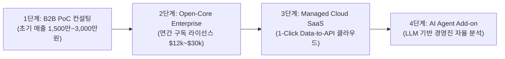

# 26. 비즈니스 모델(BM) 및 엔터프라이즈 고객 제안 플레이북

본 문서는 **Auto Data Analyzer & ML Scout** 오픈소스 프로젝트를 기반으로 **지속 가능한 현금 흐름을 창출하고 B2B 엔터프라이즈 고객을 유치하기 위한 상용화 실행 전략 명세서**입니다.

---

## 1. 상용화 4단계 로드맵 (From Stars to Revenue)



1. **1단계: 2주 퀵스타트 PoC 컨설팅 (즉각적인 현금 흐름 창출)**
   - 데이터 분석/AI 도입을 원하지만 내부 인력이 부족한 중소/중견기업 대상.
   - 고객사 DB 마트의 1~2개 테이블을 대상으로 2주 만에 맞춤형 모델 서빙 API + 임원 보고 덱 납품.
2. **2단계: Open-Core 온프레미스 기업 라이선스 (연간 반복 매출, ARR)**
   - 대기업/금융사/공공기관의 망분리 또는 사내 프라이빗 클라우드(VPC) 환경 전용 패키징.
   - Snowflake, Databricks, Redshift 직결, 사내 SSO(Okta) 및 RBAC 연동.
3. **3단계: 완전 관리형 Managed Cloud SaaS**
   - 개발자 없이도 웹 브라우저에서 DB 접속 정보만 넣으면 실시간 모델 호스팅 API 엔드포인트 유지 관리.
4. **4단계: LLM 결합 자율 분석 에이전트 구독**
   - 텍스트 질의 기반 자동화 보고서 작성 및 모델 재학습 에이전트.

---

## 2. 에디션별 가격 책정표 (Pricing Strategy)

| 구분 | Community (무료 오픈소스) | Professional (스타트업/팀) | Enterprise (기업/금융/공공) |
|:---|:---|:---|:---|
| **가격 (연간 결제)** | **Free ($0)** | **월 $499 (연 $5,000)** | **연 $24,000 ~ $60,000** (맞춤 견적) |
| **타겟** | 개인 개발자, 연구원, 학생 | 시리즈 A~B 스타트업 데이터팀 | 중견/대기업, 금융, 헬스케어 |
| **데이터 연결** | 로컬 CSV, SQLite, PostgreSQL | + MySQL, MariaDB, MS-SQL | **+ Snowflake, BigQuery, Databricks, Oracle, SAP** |
| **배포 환경** | 로컬 단일 머신 | 로컬 Docker Compose | **사내 VPC / 온프레미스 Kubernetes 배포** |
| **보안 & 거버넌스** | 기본 PII 마스킹 | PII 마스킹 + 데이터 검증 리포트 | **SSO (SAML/Okta), RBAC, 감사 로그, 망분리 지원** |
| **MLOps & 모니터링** | 단일 FastAPI 서빙 코드 | 자동 드리프트 경고 (Slack 연동) | **실시간 드리프트 감지 + 자동 재학습 파이프라인 (Airflow)** |
| **산출물 커스텀** | 기본 16:9 화이트/블루 PPTX | 팀 로고 삽입 | **고객사 전용 C-Level 슬라이드 마스터/CI 완벽 반영** |
| **기술 지원** | GitHub Discussions / Issues | 이메일 지원 (영업일 24시간 내) | **전담 엔지니어 배정 & SLA 4시간 보장 Slack 채널** |

---

## 3. B2B 엔터프라이즈 미팅용 1-Pager 제안서 템플릿

고객사 미팅이나 제휴 시 배포할 수 있는 1페이지 요약 제안서 구조입니다.

```markdown
# [제안서] Auto Data Analyzer Enterprise: 60초 만에 구축하는 엔터프라이즈 데이터 머신러닝 파이프라인

### 1. 기업 데이터팀의 3대 고질적 병목
- **운영 안정성 부담**: 운영 DB에서 ML 학습용 데이터를 추출할 때 서비스 부하 및 개인정보(PII) 유출 위험.
- **수작업 피처 엔지니어링**: 데이터 누수(Data Leakage) 검증과 다중공선성 정리에 수 주 소요.
- **비즈니스 설득과 배포의 단절**: 모델 코드를 짜더라도 임원 보고용 슬라이드와 운영 서빙 API를 별도로 개발해야 함.

### 2. Auto Data Analyzer가 제공하는 핵심 비즈니스 임팩트
- **무손실 안전 DB 연동**: 읽기 전용 트랜잭션과 Bernoulli 샘플링으로 기존 운영 DB 부하 0% 달성.
- **도입 기간 단축**: 기존 4~8주 걸리던 '데이터 탐색 → 모델 선발 → API 개통'을 단 **3일**로 단축.
- **경영진 커뮤니케이션 자동화**: 비즈니스 메트릭 기반의 완성형 16:9 프레젠테이션 덱을 원클릭 자동 생성.

### 3. 도입 및 PoC 프로세스 (2주 완료)
- 1주차: 고객사 개발/스테이징 DB 안전 연동 및 샘플 마트 프로파일링.
- 2주차: 6개 모델 토너먼트 진행, 최적 챔피언 모델 선발, 사내 내부망 서빙 API 개통 및 임원 보고회.
```

---

## 4. 잠재 고객 리드 수집용 웨이팅리스트(Waitlist) 질문지

README 및 랜딩페이지에 걸어둘 구글 폼/Typeform 질문 항목입니다:

1. **회사명 및 담당 부서/직책**
2. **현재 주로 사용 중인 데이터베이스 / 데이터 웨어하우스**:
   - [ ] PostgreSQL / MySQL
   - [ ] Snowflake / Databricks
   - [ ] Google BigQuery / AWS Redshift
   - [ ] Oracle / MS-SQL
   - [ ] 기타 (직접 입력)
3. **현재 데이터 분석 및 ML 도입 시 가장 큰 어려움**:
   - [ ] 데이터 추출 및 보안/개인정보 승인 절차의 번거로움
   - [ ] 피처 엔지니어링 및 모델 튜닝 시간 부족
   - [ ] 학습된 모델을 실제 서빙 API로 배포하는 인프라 부족
   - [ ] 비개발 이해관계자(경영진/현업) 설득용 보고서 작성 부담
4. **관심 있는 엔터프라이즈 기능**:
   - [ ] 클라우드 DW (Snowflake/BigQuery) 커넥터
   - [ ] 실시간 데이터 드리프트 모니터링 & 자동 재학습
   - [ ] 사내 맞춤형 임원 보고 PPTX 슬라이드 자동 생성
   - [ ] 사내 폐쇄망(Air-gapped) 또는 프라이빗 VPC 구축
5. **연락처 (업무용 이메일)**
